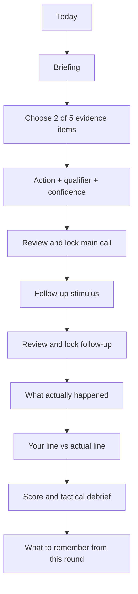

# CS2 Daily Games Platform — Phase 2B Selected Design Specification

**Status:** Proposed for approval  
**Date:** 31 August 2026  
**Selected direction:** A — Editorial Tactical Desk  
**Source of truth:** Approved Phase 1 PRD and Phase 2 design exploration  
**Scope:** Screen-level product and interface definition only. No repository, application code, Cloudflare architecture, production assets, final product name, or final brand identity.

---

## 1. Selection record

The user selected **Design A — Editorial Tactical Desk** as the visual, structural, and interaction foundation.

The selected design borrows only these bounded elements:

### From Design B — Quiet Signal Instrument

- the explicit information-status grammar: **Confirmed / Last seen / Inferred / Unknown**;
- high-quality abstract tactical diagrams;
- information-age indicators showing how old a disclosed signal is.

### From Design C — Round Review Filmstrip

- after both answers are locked, a clear comparison between **Your line** and **What actually happened**;
- every case ends with a short **What to remember from this round** principle.

These are components inside A. They do not import B's command-table layout, dark instrument identity, diagram-first interaction, or decision sheet. They do not import C's filmstrip, replay-led navigation, single-card ladder, or coaching-first tone.

The dominant mental model remains:

> A carefully edited tactical case file in which the player studies the disclosed record, submits an analyst call, and receives a disciplined after-action report.

---

## 2. Product and phase locks

This specification preserves the approved product contract:

- one shared deep case is the flagship;
- the measured session target is 5–8 minutes and is untimed;
- exactly two of five evidence items are selected;
- the main response contains one action, one valid qualifier, and a separate confidence label;
- the official beta score is deterministic: 50 main call/execution, 20 evidence, 30 follow-up;
- one finite follow-up uses either New Information or Economy/Risk;
- the canonical continuation is independent of the player's answer;
- multiple defensible lines are first-class;
- Today and the full debrief remain free;
- no login, leaderboard, prizes, response timer, or AI-scored prose in MVP;
- closed beta begins at three cases per week; public daily cadence remains gated;
- original synthetic cases and original abstract schematics are the MVP foundation;
- credible human tactical review remains an operational dependency.

The complete case contract is:



The score is not the finish. The explicit final principle marks `debrief_complete`.

---

## 3. Experience thesis

The product should feel:

- editorial, not journalistic;
- tactical, not militaristic;
- premium, not luxurious;
- game-like through commitment and consequence, not rewards furniture;
- authoritative through disclosed facts, structured judgment, and provenance;
- calm enough to read, but brisk enough to replay three times per week.

The core attention sequence is:

1. **Orient:** What is objectively true?
2. **Prioritize:** Which two facts matter most?
3. **Commit:** What is the line and how is it executed?
4. **Adapt:** Does the new information change the line?
5. **Compare:** What did you choose, and what did the authored round do?
6. **Understand:** Why did the line receive its band?
7. **Transfer:** What principle should survive beyond this case?

The interface never suggests that matching the observed continuation is automatically correct. `What actually happened` is a factual record; the tactical evaluation is a separate editorial judgment.

---

## 4. Information architecture

### Primary destinations

| Destination | Purpose | MVP emphasis |
|---|---|---|
| Today | Start, resume, recover, or review the current official edition | One dominant case action |
| Cases | Review released cases and enter clearly labelled practice | Chronological casebook |
| Progress | Show participation and later eligible lens patterns | Sample honesty over gamification |

No fourth primary destination is added. Privacy, settings, glossary, methodology, corrections, and legal notices live in the utility menu or page footer.

### Active-case shell

Global navigation disappears during a case and is replaced by:

- context back control: `Back to Today` or `Back to Cases`;
- edition and stage;
- one utility menu containing Guided/Standard, diagram/text view, glossary, appearance, and accessibility-relevant preferences;
- one persistent stage indicator;
- one bottom safe-area action region on compact screens.

Leaving before a commit preserves a compatible draft. Leaving after a commit preserves the server-acknowledged state. No exit action submits an answer.

### Stage labels

Use these player-facing stage labels:

1. Brief
2. Evidence
3. Call
4. Update
5. Review

`Update` replaces the more judgmental `Adapt`. The user may rationally keep the original line.

The Review stage contains continuation, result, debrief, and the final principle. Subsection headings and progress text make the longer stage understandable without adding more global steps.

---

## 5. Responsive structure

### Breakpoints

| Range | Structure |
|---|---|
| 320–767 CSS px | Canonical one-column mobile layout |
| 768–1199 CSS px | One reading column plus optional inline notes |
| 1200 CSS px and above | Three-part editorial desk |

Breakpoints respond to content, not device names. At 200% browser zoom, the interface reflows to the compact document layout.

### Desktop editorial desk

Maximum application width is 1440 px with 32–40 px outer gutters.

| Region | Target width | Function |
|---|---:|---|
| Folio rail | 120–144 px | Edition, UTC date, focus, stage, status |
| Reading canvas | minmax(0, 760–840 px) | Current primary task |
| Case-notes rail | 264–304 px | Legend, fact ledger, selected evidence, assumptions, glossary |

The reading canvas owns the only dominant heading and primary action. The notes rail never becomes a second dashboard.

### Mobile briefing deck

- 16 px gutters at 320–374 px; 20 px at 375 px and above;
- one readable column;
- full-width diagram, fact groups, evidence rows, and choice cards;
- selected-evidence summary above the Call controls;
- non-nested disclosure for case notes and glossary;
- sticky action area with safe-area padding;
- focused content receives scroll padding equal to the sticky action height;
- no bottom navigation during a case.

### Intermediate layout

At tablet and narrow desktop widths, the folio becomes a compact horizontal case header. Case notes move into an inline panel after the diagram or a single disclosure beside the current task. The primary task never shrinks below a comfortable reading width to preserve a rail.

---

## 6. Global visual system

### Colour modes

Dark and light modes are equal, with the operating-system preference used on first visit. The preference can be changed and persists locally.

#### Dark concept tokens

| Token | Value | Use |
|---|---|---|
| Canvas | `#101416` | Page background |
| Surface | `#181D20` | Cards and reading surfaces |
| Surface raised | `#22292D` | Selected or elevated local state |
| Text | `#F2EFE8` | Primary text |
| Text muted | `#B9BCB8` | Secondary text |
| Rule | `#687177` | Meaningful borders and dividers |
| Oxide | `#D08463` | Attention and editorial emphasis |
| Steel | `#8DB2C5` | Tactical links and focus-supporting detail |
| Focus | `#A8CBE0` | High-visibility focus ring |

#### Light concept tokens

| Token | Value | Use |
|---|---|---|
| Canvas | `#F2EEE6` | Page background |
| Surface | `#FFFDF8` | Cards and reading surfaces |
| Surface raised | `#E8E3D9` | Selected or elevated local state |
| Text | `#192024` | Primary text |
| Text muted | `#50595E` | Secondary text |
| Rule | `#717A7F` | Meaningful borders and dividers |
| Oxide | `#91482F` | Attention and editorial emphasis |
| Steel | `#315F79` | Tactical links and focus-supporting detail |
| Focus | `#174F73` | High-visibility focus ring |

These are design-definition candidates, not implementation approval. Every text, focus, selected, disabled, diagram, and forced-colour combination must pass contrast testing before production.

Colour never independently communicates information status, team, alive/dead, selection, correctness, or change.

### Typography

| Role | Typeface | Desktop | Mobile |
|---|---|---:|---:|
| Display lead | Newsreader Variable | 34/40 | 29/35 |
| Section opening | Newsreader Variable | 26/32 | 24/30 |
| Page/stage heading | DM Sans Variable 650 | 28/34 | 24/30 |
| Subheading | DM Sans Variable 650 | 20/26 | 19/25 |
| Body | DM Sans Variable 400 | 17/26 | 16/24 |
| Control | DM Sans Variable 550 | 16/22 | 16/22 |
| Metadata | DM Sans Variable 600 | 13/18 | 13/18 |
| Numeric state | DM Sans, tabular numerals | Contextual | Contextual |

Newsreader is limited to the case lead, debrief section openings, and the final transferable principle. It never appears inside controls, evidence choices, telemetry, status labels, or dense fact groups.

Line length targets 50–72 characters. Sentence case is standard. Uppercase is reserved for metadata labels no longer than three words.

### Spacing and geometry

- base spacing unit: 4 px;
- principal gaps: 8, 12, 16, 24, 32, 48, and 64 px;
- compact control radius: 6 px;
- card and panel radius: 8 px;
- modal/sheet radius: 12 px;
- borders: normally 1 px; 2 px for selected state or high-contrast separation;
- shadows: none on flat editorial surfaces; one restrained shadow only for a modal or mobile confirmation sheet;
- minimum target: 44×44 CSS px; primary actions prefer 48 px height.

No glass, blur, fake paper, page curl, tape, stamps, torn edges, handwriting, photocopy grain, scan lines, neon glow, or ornamental tactical grid.

### Iconography

Use a small original line-icon family with 1.75–2 px strokes. Icons always accompany text for status and primary actions. Tactical markers use the separate diagram grammar in Section 8.

---

## 7. Shared case-page anatomy

Every pre-answer case screen follows the same order:

1. case header and stage;
2. stage heading and one-sentence instruction;
3. disclosed state or state change;
4. current decision controls;
5. local selection summary when relevant;
6. one primary action;
7. optional case notes, glossary, assumptions, and methodology.

Every post-answer Review screen follows:

1. canonical continuation;
2. Your line vs What actually happened;
3. score summary and bands;
4. detailed reasoning;
5. strongest accepted alternative;
6. one-variable counterfactual;
7. sources, provenance, and editorial status;
8. What to remember from this round;
9. completion actions.

The comparison precedes evaluation so the player can first distinguish the two records. The score cannot visually imply that copying the observed line was the objective.

---

## 8. Abstract tactical-diagram system

### Purpose

The diagram answers three questions only:

1. Where can relevant actors or objectives be?
2. What routes, timings, visibility, or utility relationships matter?
3. How reliable and how old is each disclosed piece of information?

It does not simulate CS2, reproduce a radar, decorate empty space, or contain undisclosed knowledge.

### Geometry rules

- original zone-and-route schematics, not copied or trace-derived map geometry;
- named zones use short editorial labels such as `A site`, `Connector`, or case-specific neutral names;
- zones are simple polygons with sufficient internal label space;
- routes are explicit lines with arrowheads only when direction matters;
- case-supplied travel times appear on the route, for example `≈ 6 s`;
- line of sight is a thin bounded wedge or labelled relationship, never an implied realistic angle;
- utility coverage is a patterned region with a text label and duration only when disclosed;
- vertical relationships use labelled level markers rather than pseudo-3D perspective;
- no exact scale is implied unless the case declares one;
- the legend is always adjacent or reachable in one disclosure.

### Actor and objective markers

| Meaning | Visual form | Required text equivalent |
|---|---|---|
| Friendly active player | Filled circle with short role label | Team, role, zone, status |
| Opponent confirmed | Filled diamond | Team, confirmed zone, source/time |
| Opponent last seen | Open diamond with clock notch | Last-seen zone and age |
| Opponent inferred | Hatched diamond with `~` mark | Inference, basis, uncertainty |
| Opponent unknown | No speculative map marker | Explicit Unknown entry in ledger |
| Dead player | Marker with internal cross and `dead` label | Team, dead status |
| Bomb/objective confirmed | Filled square | Confirmed location and time/source |
| Bomb/objective last seen | Open square | Last-seen location and age |
| Destination or hold zone | Bracketed area | Zone purpose |
| Route | Solid directed line | Origin, destination, direction, time if known |
| Possible route | Dashed directed line | Possibility and why it is disclosed |
| Denied or impossible route | Dotted line ending in bar | Reason it is unavailable |

Unknown information is represented by deliberate absence from the map plus a prominent `Unknown` fact row. The interface never places a mystery marker at a location the player does not know.

### Information-status grammar

Every material fact belongs to exactly one visible category:

| Status | Meaning | Label pattern | Diagram treatment |
|---|---|---|---|
| Confirmed | True at the stated current case time | `Confirmed · now` or `Confirmed · 00:31` | Filled marker, solid edge |
| Last seen | Observed earlier and not reconfirmed | `Last seen · 8 s ago` | Open marker, short age tick |
| Inferred | Editorially permitted deduction from disclosed evidence | `Inferred · from utility + timing` | Hatched marker/region, dashed edge |
| Unknown | Intentionally not known | `Unknown · no bomb confirmation` | Ledger entry only; no located marker |

Information age is expressed as exact elapsed case time when mechanically available: `3 s ago`, `8 s ago`, `16 s ago`. Avoid vague labels such as Fresh, Old, Likely, or Probably unless they are authored prose outside the official fact state.

Age never uses a continuously running animation. The case clock is frozen evidence. When the follow-up advances authored time, age labels update in one explicit state change.

### Status transitions in New Information

New Information is grouped into:

- **New:** facts first disclosed at the follow-up;
- **Changed:** facts whose state or age materially changed;
- **Expired:** prior information no longer reliable under the case contract;
- **Unchanged:** facts deliberately confirmed as still holding.

The diagram uses a short static before/now comparison or an optional one-time transition. Text lists every change. Reduced-motion mode shows only the two static states.

### Diagram controls

- `Diagram` and `Text` are equal segmented controls, not a primary view plus accessibility fallback;
- explicit `Zoom out`, `Fit`, and `Zoom in` controls appear only where needed;
- pan is optional and never required for comprehension or selection;
- reset returns to the authored fit state;
- view changes preserve all draft and acknowledged state;
- the diagram itself contains no selectable answer choices in MVP.

### Canonical structured-text equivalent

The Text view includes, in this order:

1. objective and clock;
2. manpower and relevant health/utility/economy;
3. confirmed locations;
4. last-seen locations with age;
5. disclosed inferences with basis;
6. explicit unknowns;
7. routes, direction, and case-supplied travel time;
8. constraints, assumptions, and normative clarifications.

If a visual and textual interpretation could conflict, the structured text is normative and the diagram must be corrected before publication.

### Diagram acceptance checks

- useful at 320 CSS px without forced landscape;
- readable at 200% zoom through reflow or Text view;
- complete in forced colours/high contrast;
- distinguishable with monochrome output;
- understandable without colour, motion, or icon recognition;
- no pre-commit answer value encoded by position, size, contrast, animation, DOM order, accessible name, or metadata;
- no copied recognizable geometry or unlicensed game asset.

---

## 9. Screen specifications

### 9.1 Today — new edition

**Purpose:** Establish the current assignment and create one clean start decision.

**Required content:**

- working product wordmark placeholder and unofficial-product notice in the shell;
- edition number and full UTC date;
- explicit `Resets 00:00 UTC`;
- status `New`;
- broad tactical focus;
- estimated `5–8 min`;
- one neutral tension sentence that cannot leak the rubric;
- `Synthetic scenario — editorial tactical analysis` or cleared professional label;
- primary action `Start case`.

**Desktop:** The case lead occupies the reading canvas. The folio shows edition/date/status. The notes rail contains format, mode, and privacy-shortcut information only.

**Mobile:** One case cover, one primary action, and a compact metadata row. No promotional tiles, archive teaser carousel, score preview, or activity feed competes with Start.

### 9.2 Today — alternate authoritative states

The same case cover changes status and action without changing structure:

| State | Primary action | Secondary information |
|---|---|---|
| In progress | Continue | Last locally saved or server-acknowledged stage |
| Draft saved locally | Continue | Not officially submitted or credited |
| Main locked | Retry main submission | Same immutable main line will be recovered |
| Result pending | Retry result | Accepted follow-up remains frozen |
| Decision complete | View debrief | Participation awarded; learning incomplete |
| Complete | Review | Score and completion date |
| Previous edition in grace | New edition remains primary | Separate `Resume previous` action and grace end |
| Practice available | Play practice | No official credit, streak, distribution, or lens impact |
| Corrected | Read correction | Correction status and revision |
| Void/withdrawn | View neutral record | Participation treatment and restricted-content notice |
| Unavailable | Retry later | No consumed attempt |
| Session-only play | Start session | History may not survive token loss |

Device date/time never changes the authoritative edition or grace window.

### 9.3 Brief

**Heading:** `Read the round`

**Order:**

1. objective in one sentence;
2. diagram/text toggle;
3. abstract schematic or structured text;
4. current round ledger;
5. information-status ledger;
6. disclosed assumptions and constraints;
7. primary action `Choose evidence`.

The right rail groups facts under Confirmed, Last seen, Inferred, and Unknown. On mobile these groups follow the diagram and precede the action.

Guided mode adds definitions and one neutral authored cue naming a dimension such as `Check how old the weak-side information is.` It cannot name an answer or preferred evidence choice. Taking the cue marks the attempt Assisted.

### 9.4 Evidence

**Heading:** `Choose the two facts that matter most`

Five evidence rows share the same dimensions, typography, specificity, and interaction treatment.

Each row contains:

- native checkbox semantics;
- short evidence title;
- one concise factual description;
- optional information-status/age label when genuinely applicable;
- optional glossary term.

A two-slot `What matters` summary remains visible in the notes rail or immediately above the mobile action area. It shows `0 of 2`, `1 of 2`, or `2 of 2`.

Rules:

- selecting a third item prompts `Remove one selection before adding another`;
- it never silently replaces the oldest choice;
- item order cannot encode rubric preference;
- Continue is disabled until exactly two are selected and explains why;
- evidence descriptions contain no hidden band or future-state metadata.

Primary action: `Continue to call`.

### 9.5 Call

**Heading:** `Make the call`

**Order:**

1. selected-evidence summary;
2. action radio group;
3. valid qualifier radio group after an action is selected;
4. confidence segmented radio group;
5. primary action `Review call`.

Actions are operationally parallel and use consistent grammar, normally `Verb + tactical object`, such as `Hold and re-clear` or `Rotate with utility`.

The qualifier answers `How?`, `Through where?`, `With whom?`, or `Under what constraint?` Only case-valid qualifiers appear. The interface does not reveal missing combinations or why a qualifier is absent.

Confidence is visually separated with the label `Unscored reflection` and choices:

- Guessing
- Leaning
- Fairly sure
- Strong read

No numeric probability appears in MVP.

### 9.6 Review and lock main call

**Heading:** `Review your line`

Show a concise immutable-preview card containing:

- action;
- qualifier;
- exactly two evidence items;
- confidence, explicitly unscored;
- `You cannot change this official line after it is locked.`

Actions:

- secondary `Edit call`;
- primary `Lock main call`.

On activation, the button enters `Submitting…` while keeping the summary visible. Only server acknowledgement changes the state to `Main locked`. Focus moves to the `New information` or `Economy and risk` heading.

If the response is lost after acknowledgement, the accepted line stays visually frozen and the user receives `Retry main submission`, using the same idempotency key. No second line can be authored.

### 9.7 Update — New Information

**Heading:** `The round changed`

The top of the screen retains the locked main line in a compact read-only card.

The update contains:

- authored timestamp transition, for example `00:31 → 00:23`;
- New, Changed, Expired, and Unchanged fact groups as applicable;
- updated diagram/text representation;
- one finite response radio group at the same abstraction level;
- primary action `Review update`.

Possible response grammar may include `Keep the original line` and case-specific alternatives. Keeping the line receives equal visual dignity.

The interface never calls a changed response better, more adaptive, or more expert before grading.

### 9.8 Update — Economy/Risk

**Heading:** `Choose the risk posture`

Required disclosed context:

- ruleset/build and price context;
- current money;
- saved equipment;
- loss-income state;
- score and remaining-round horizon;
- opponent economy status: Confirmed, Last seen with age, Inferred with basis, or Unknown.

Each prevalidated package contains:

- item summary;
- total price;
- current-round reserve;
- protected future reserve;
- affordable status;
- one concise trade-off line.

Controls:

1. finite posture radio group;
2. separate finite allocation-priority radio group;
3. `Review update`.

There is no free-form buy builder, cart, drag allocation, arbitrary slider, or implied opponent-buy probability.

### 9.9 Review and lock follow-up

Use the same commitment pattern as the main call:

- locked original line;
- new stimulus summary;
- selected follow-up response;
- explicit permanence notice;
- `Edit update` and `Lock follow-up`.

After acknowledgement, the official decision is complete. A lost result response shows `Result pending` and only `Retry result`; it never reopens the update.

### 9.10 What actually happened

**Heading:** `What actually happened`

Opening copy:

> This is the authored round record. It did not change because of your answer.

Present immediately as a static event list:

- timestamp;
- observed/authored action;
- disclosed consequence;
- final relevant state.

If motion is enabled, optional controls are `Step`, `Replay`, and `Show final state`. Static text is available from the start, and no animation blocks the result.

For synthetic cases, use `Authored continuation`. For a rights-cleared professional case, use `Observed continuation` and disclose the record's limitations.

### 9.11 Your line vs What actually happened

**Heading:** `Your line and the round record`

This is a two-column comparison on desktop and two stacked, equally weighted cards on mobile.

| Your line | What actually happened |
|---|---|
| Player action + qualifier | Authored/observed action |
| Player evidence pair | Material information used in the record |
| Player follow-up | Authored/observed continuation response |
| Player confidence | Not applicable |

Rules:

- headings never use `Correct line` or `Wrong line`;
- matching elements can be linked by a quiet rule, but difference is not automatically failure;
- the actual record never receives a gold, green, or idealized treatment;
- if the player's line is stronger than the observed professional line under disclosed information, the debrief says so;
- if several lines are equal, comparison labels them as parallel, not ranked by similarity.

Mobile order is Your line first, then What actually happened, followed by `How the line was judged`.

### 9.12 Result summary

**Heading:** `How the line was judged`

The first evaluation block shows:

- total score `/100`;
- `Main x/50`;
- `Evidence x/20`;
- `Follow-up x/30`;
- main-call band;
- follow-up band;
- confidence separately as unscored;
- official/practice/assisted status;
- participation credit.

Evidence has points but no separate band. Bars, if used, are straight labelled measures and never resemble a speedometer, ELO, rank, percentile, or player-skill rating.

Band language is limited to:

- Best-supported
- Equally strong
- Defensible
- Conditional / high-variance
- Weak
- Not feasible

The score summary precedes detailed analysis and is fully available as text.

### 9.13 Tactical debrief

**Heading:** `Why the line received this result`

Required order:

1. **Why it works** — the central tactical logic;
2. **Cost** — what space, utility, economy, time, or trade structure it gives up;
3. **Assumption** — which disclosed fact or inference must hold;
4. **Breaks when** — the specific condition that collapses the line;
5. **Evidence review** — why each selected fact mattered or mattered less;
6. **Follow-up review** — what the second decision protected or exposed;
7. **Strongest alternative** — a parallel accepted line with its own cost;
8. **One-variable counterfactual** — change one declared fact and show how the preferred set changes;
9. **Sources and method** — facts, reviewer judgment, accepted lines, and interpretation separated.

No section uses scolding language. Rejected lines receive a factual or rubric reason. Missing defensible lines can be reported through the structured form.

### 9.14 What to remember from this round

**Heading:** `What to remember from this round`

This is the final editorial card and the only required use of a larger Newsreader treatment after the case lead.

Content contract:

- one principle;
- normally 18–35 words, maximum 45;
- transferable beyond the named map, team, buy, or exact round;
- written as an actionable tactical relationship;
- no score language, motivational filler, or hindsight-dependent instruction.

Good pattern:

> When your weak-side information is older than the opponent's fastest rotation route, re-clear before moving the second defender.

Bad patterns:

- `Great job—keep improving!`
- `Always rotate earlier.`
- `In this round, the answer was B.`
- `Remember that the opponent went A.`

The player activates `Finish review` after reaching this card. This explicit action records `debrief_complete`; scrolling alone cannot do so.

Completion actions then appear:

- Share result;
- Review case;
- Back to Today or Cases;
- optional eligible Practice.

### 9.15 Cases

Cases is a chronological casebook, not a level-select grid.

Each entry shows:

- edition/date;
- case focus;
- synthetic/professional status;
- rules/map-schematic revision when relevant;
- status: Complete, Decision complete, Practice available, Corrected, Void, or Withdrawn;
- primary action: Review, Finish debrief, or Play practice.

Filters may include focus and case status. They cannot expose unreleased inventory or implied answers. Practice is visibly labelled and never affects official participation, streak, distribution, retention, or lens performance.

### 9.16 Progress

Before thresholds, Progress shows:

- released-edition participation;
- latest 3-edition completion pattern in beta;
- exact official sample count;
- debrief completion count;
- `More cases are needed before tactical patterns are shown.`

Lens performance appears only after five scored official samples in that lens and 15 scored official cases overall. Assisted attempts remain excluded from lens performance until score neutrality is demonstrated.

Progress never claims to measure overall CS2 skill. No rank, ELO, league, global comparison, or streak-loss warning appears.

### 9.17 Privacy and history controls

The privacy surface contains:

- plain-language explanation of local progress and its loss/reset behavior;
- pseudonymous server attempt records and retention;
- analytics categories and approved controls;
- `Clear local progress`;
- token-proven `Delete server history`;
- warning not to enter personal information;
- future AI-processing notice only when that feature exists.

Destructive actions require a clear confirmation, exact scope, and recovery implications. Clearing local storage must not be described as deleting server history.

### 9.18 Corrections, voids, and withdrawals

Correction records use the same sober editorial layout:

- what changed;
- why;
- original case/rubric revision;
- current case/rubric revision;
- original and recalculated result when deterministic recalculation is valid;
- participation treatment;
- source or rights limitation when content is withdrawn.

Restricted content is removed when rights require it. A neutral participation record remains where permitted.

### 9.19 Fairness report

After reveal, `Report a missing line or fact` opens a structured form with exactly:

- Missing action
- Missing qualifier
- Missing evidence
- Incorrect disclosed fact
- Other

MVP has no free text. Submitted, pending, resolved, and correction-linked states are visible. Submitting a report does not locally alter the official score.

### 9.20 Sharing

Native Web Share and Copy expose text only:

```text
CS Daily · Edition 018 · 74/100
Main 39/50 · Evidence 15/20 · Follow-up 20/30
Confidence: Leaning · 2 of the latest 3 editions
```

No URL, image, map/team/player/event identity, action, evidence, rationale, follow-up event, answer-dependent prose, or verified badge is included. Cancelling restores focus to Share.

---

## 10. Component specification

### 10.1 Evidence row

| State | Visual | Behavior |
|---|---|---|
| Default | Flat surface, visible checkbox, neutral rule | Full row activates checkbox |
| Hover-capable | Small surface change | No essential hover-only content |
| Focus | 2–3 px external focus ring | Remains visible in forced colours |
| Selected | Check, 2 px rule, `Selected` accessible state | Added to What matters summary |
| Limit reached | Unselected rows remain readable | Activation explains remove-one rule |
| Disabled | Reduced emphasis plus reason | Not used to imply wrongness |
| Locked | Read-only check and lock text | Cannot be altered |

### 10.2 Operational choice card

Native radio semantics underpin action, qualifier, confidence, posture, priority, and follow-up groups. Each group has a visible legend. Selection uses border, fill, radio state, and text—not colour alone.

### 10.3 Fact ledger row

Contains status word, shape, fact, source/basis, and age where applicable. It is never interactive unless opening a glossary definition.

### 10.4 Commitment review card

One summary card is reused for both commits. It preserves the complete proposed payload while the request is pending and becomes a locked record only after acknowledgement.

### 10.5 Status notice

Statuses use a consistent structure:

- short status heading;
- factual description;
- one primary recovery action;
- optional technical reference that contains no answer-bearing data.

Error notices do not use `wrong` for network, validation, or state-transition failures.

### 10.6 Disclosure

Glossary, assumptions, case notes, methodology, and source detail use one-level native disclosure patterns. Disclosures cannot nest inside one another on mobile.

### 10.7 Modal and sheet

Use only for destructive confirmation, structured report, or compact share actions. Main answers are never selected or committed in a modal. Focus is trapped, Escape/cancel works where safe, and focus returns to the invoking control.

---

## 11. Interaction-state matrix

| State | User can edit | Primary treatment | Exit/recovery |
|---|---|---|---|
| Local draft | Current uncommitted fields | `Draft on this device` | Leave safely; Continue restores |
| Validating | No duplicate action | Inline `Checking…` | Failure returns focus to group |
| Submitting main | No edits during request | Summary remains; `Submitting…` | Retry same key if lost |
| Main locked | Follow-up only | Static lock and acknowledged time | Cannot reopen main |
| Submitting follow-up | No edits during request | Update summary remains | Retry same key if lost |
| Result pending | Nothing | Frozen branch; `Retry result` | Same accepted result only |
| Revision conflict before commit | Compatible draft preserved | `Update required` | Refresh case |
| Offline before commit | Local draft only | `Not officially submitted` | Continue or Retry connection |
| Server failure before acknowledgement | Existing draft preserved | No attempt consumed by UI claim | Retry safely |
| Decision complete | Debrief only | Participation awarded | Resume Review |
| Complete | Read/share/practice | Stable result | Review at any time |
| Corrected | Read-only record | Correction banner + revisions | Review corrected result |
| Withdrawn | Restricted neutral record | Rights/source notice | Participation treatment shown |

Server acknowledgement, not animation or client optimism, controls each locked state.

---

## 12. Motion and feedback

### Standard motion

- selection: 100–160 ms border/fill/check transition;
- disclosure: 160–220 ms, while content remains available without animation;
- stage transition: 180–260 ms opacity plus maximum 8 px translation;
- acknowledged lock: static registration mark appears within 160 ms after server response;
- update: one 220–300 ms insertion of the new fact group;
- optional continuation trace: maximum 500 ms and independently skippable;
- result measures: one 250–400 ms settle, with values present to assistive technology immediately.

### Reduced motion

- immediate state swaps;
- static before/now diagrams;
- explicit New, Changed, Expired, and Unchanged labels;
- no route drawing, count-up, parallax, pulsing, shaking, or scroll-linked reveal;
- focus still moves to the new stage heading.

### Audio and haptics

Neither is required. MVP should not add game audio. Optional subtle device haptics, if later considered, cannot communicate unique information and must respect platform settings.

---

## 13. Content design

### Voice

- concise, exact, and calm;
- assumes CS familiarity without excluding improvement-minded players;
- distinguishes fact, inference, reviewer judgment, and observed outcome;
- avoids hype, scolding, fake certainty, and coach cosplay.

### Preferred verbs

Use `Read`, `Choose`, `Make`, `Review`, `Lock`, `Continue`, `Compare`, and `Remember`.

Avoid `Crush`, `Dominate`, `Prove`, `Beat`, `Outsmart`, `Master`, or `Pass`.

### Required terminology boundaries

- `Confirmed` means mechanically or editorially verified at the stated time.
- `Last seen` always includes an age.
- `Inferred` always includes a disclosed basis.
- `Unknown` is a positive disclosed state, not missing UI.
- `Actually happened` refers only to the authored/observed record.
- `Best-supported` refers to evaluation under disclosed information and rubric.
- `Official` refers to attempt/edition status, never product affiliation.

### Length budgets

| Element | Target | Maximum |
|---|---:|---:|
| Today tension | 12–22 words | 30 |
| Objective | 12–24 words | 34 |
| Evidence title | 2–7 words | 9 |
| Evidence description | 10–24 words | 34 |
| Action label | 2–6 words | 8 |
| Qualifier | 2–8 words | 12 |
| Update fact | 8–22 words | 30 |
| Result rationale opening | 25–60 words | 90 |
| Transferable principle | 18–35 words | 45 |

Stress testing must cover 150% of each target and the maximum translated expansion expected before localization is authorized.

---

## 14. Accessibility specification

### Semantics and reading order

- one `main` landmark and one primary heading per state;
- textual stage indicator exposes current-step semantics;
- native checkbox and radio-group behavior;
- diagram has a concise accessible name and points to the full structured text;
- updates announce the heading and a short change summary, not the whole page;
- score summary is encountered before detailed analysis;
- lock status is announced only after acknowledgement;
- no rubric values, future facts, or answer metadata in accessibility labels.

### Keyboard order

Brief → Diagram/Text → facts and optional glossary → evidence → action → qualifier → confidence → review → lock → update → review → lock → continuation → comparison → score → debrief → principle → Finish review.

The notes rail follows the current primary content in DOM order even when visually placed beside it.

### Focus

- visible in dark, light, and forced-colour modes;
- never clipped by overflow or covered by the sticky action area;
- after stage changes, moves to the new heading;
- validation moves to the first affected group and summarizes the issue;
- closing a disclosure, modal, report, or share surface returns focus logically.

### Non-visual equivalence

Full completion must be possible without sight, colour perception, motion, precision pointing, typing, hearing, or time pressure. The Text view is a first-class authored representation and not generated from alt text after publication.

### Required validation matrix

- VoiceOver + Safari on iPhone;
- TalkBack + Chrome on Android;
- NVDA + Firefox on Windows;
- keyboard-only desktop completion;
- 320 CSS px;
- 200% zoom/reflow;
- forced colours/high contrast;
- reduced motion;
- text-only case completion;
- common browser text enlargement;
- touch with screen magnification.

Target is WCAG 2.2 AA plus the product-specific integrity and recovery checks in this specification.

---

## 15. Integrity and no-leak interface requirements

Before each commit, the rendered document, accessibility tree, metadata, serialized state, cached/prefetched assets, predictable URLs, source maps, and client bundle may contain only:

- released case facts required for the current state;
- visible option IDs and labels;
- the user's current local draft;
- neutral presentation configuration.

They may not contain:

- rubric values or option ranks;
- bands or explanations;
- accepted alternatives or caps;
- counterfactuals;
- hidden flags or future states;
- canonical continuation;
- future cases or unpublished identifiers;
- answer-dependent styling or accessible descriptions.

The interface submits choices, never result values. The server controls edition, attempt, transition, branch, score, correction, and completion state.

---

## 16. Analytics contract for design validation

Events must be privacy-reviewed, pseudonymous, and contain no raw prose or hidden answer data.

Minimum product events:

| Event | Purpose |
|---|---|
| `today_loaded` | Qualified start denominator |
| `attempt_issued` | Official start |
| `brief_view_changed` | Diagram/Text parity and preference |
| `guided_mode_changed` | Mode use and assisted segmentation |
| `main_review_opened` | Pre-commit funnel |
| `main_commit_acknowledged` | Main completion |
| `followup_commit_acknowledged` | `decision_complete` |
| `continuation_viewed` | Review entry |
| `comparison_viewed` | Your-line/actual comprehension exposure |
| `result_summary_viewed` | Evaluation exposure |
| `principle_viewed` | Transfer step exposure |
| `debrief_complete` | Explicit Finish review |
| `share_opened` / `share_completed` | Spoiler-safe sharing |
| `fairness_report_submitted` | Fairness denominator |
| recovery-state events | Offline, retry, conflict, correction usability |

Do not capture exact answer selections in general-purpose analytics. Server-authoritative attempt records may retain the minimum structured choices under the approved retention policy.

---

## 17. Representative prototype package

Before Phase 3 architecture is treated as implementation-ready, the selected design should be represented using one identical, fully authored synthetic case across:

### Mobile

1. Today — New
2. Brief — Diagram
3. Brief — Text
4. Evidence — 1 of 2 and 2 of 2
5. Call
6. Review main call
7. New Information update
8. Economy/Risk update as a separate contract example
9. Review follow-up
10. What actually happened
11. Your line vs What actually happened
12. Result summary
13. Tactical debrief
14. What to remember from this round
15. Cases
16. Progress before thresholds
17. Result pending and Retry
18. Correction/withdrawal

### Desktop

1. Today
2. Brief in the editorial desk
3. Evidence
4. Call
5. Update
6. Your line vs What actually happened
7. Result and complete debrief
8. Cases/Progress shell

### Supporting specifications

- complete diagram and structured-text pair;
- focus and screen-reader order;
- component states;
- dark, light, forced-colour, and reduced-motion variants;
- 320 px and 200% reflow;
- long-copy stress cases;
- spoiler-safe share output;
- offline, pending, retry, revision conflict, correction, and withdrawal flows.

---

## 18. Design acceptance criteria

The selected design is ready to inform architecture only when reviewers can confirm:

### Product comprehension

- objective, evidence task, main call, and follow-up are unambiguous;
- users understand that confidence is unscored;
- users understand that the canonical continuation is independent of their answer;
- users distinguish observed/authored outcome from tactical evaluation;
- users can identify Confirmed, Last seen, Inferred, and Unknown information;
- information age is noticed without becoming visual noise;
- the final principle is understood as the meaningful finish.

### Mobile and accessibility

- full completion at 320 CSS px without page-level horizontal overflow;
- no required zoom, drag, hover, typing, or precision placement;
- diagram and structured text contain equivalent disclosed information;
- keyboard and named assistive-technology flows pass;
- 200% reflow, forced colours, light/dark contrast, and reduced motion pass;
- sticky controls never cover focused or error content.

### Integrity and recovery

- no answer or future-content leak before the relevant commit;
- main and follow-up acknowledgement are immutable and idempotent;
- offline draft, lost response, result pending, reset/grace, revision conflict, correction, withdrawal, and local-storage failure are understandable;
- no server failure consumes an attempt through client behavior;
- share output remains spoiler-free.

### Formative testing

- at least 80% of moderated debrief participants can explain their band, cost, and breaking condition;
- among at least 30 directional follow-up participants, at least 60% can state the transferable principle accurately after 24 hours, with numerator, denominator, and 95% confidence interval reported;
- at least 65% of `decision_complete` attempts reach `debrief_complete` in the relevant beta gate;
- active players describe the experience as tactical judgment rather than a quiz, dashboard, or lesson.

These thresholds remain subject to the fuller Phase 1 validation gates and do not replace them.

---

## 19. Explicit exclusions

This selected direction does not authorize:

- a diagram-first command table;
- a replay-first filmstrip;
- copied CS2 radar/map art or recognizable geometry without legal approval;
- weapons, screenshots, broadcast frames, logos, team/player photography, or game audio;
- fake telemetry, crosshairs, radar sweeps, scan lines, neon glow, or cyberpunk treatment;
- paper texture, stamps, folders, tape, or scrapbook metaphors;
- score celebrations, ranks, XP, coins, streak anxiety, or leaderboards;
- a free-form buy builder;
- pre-answer distributions;
- answer-bearing share cards or result URLs;
- AI-generated official scores or required prose;
- a repository, codebase, Cloudflare resource, final name, or production brand asset.

---

## 20. Approval and next phase boundary

Approval of this document locks:

1. A's editorial desk as the dominant layout and mental model;
2. the bounded B signal grammar and abstract-diagram system;
3. the bounded C Your line vs What actually happened comparison;
4. What to remember from this round as the explicit final completion step;
5. the screen order, responsive anatomy, commitment patterns, recovery treatments, and accessibility contract;
6. the proposed visual-token direction for validation, not final production values.

It does not approve a final product name, logo, production illustrations, application code, or infrastructure.

After approval, **Phase 3** may research current Cloudflare guidance and define the technical architecture, data model, server-authoritative state machine, API boundaries, security controls, content schemas, analytics implementation, and deployment plan. Phase 3 must stop for approval before repository or application implementation.
