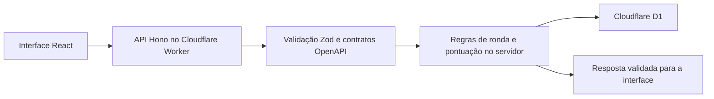

# Roundcraft

Plataforma de treino para leitura táctica de rondas de Counter-Strike 2. O jogador analisa informação incompleta, toma uma decisão fundamentada e revê a evidência que a explica.

**Estado:** em desenvolvimento. Não há demonstração pública verificada.

## Porque existe

A maioria dos jogos de navegador sobre Counter-Strike testa memória ou reconhecimento. Roundcraft explora uma pergunta mais próxima da decisão real: com a informação disponível naquele momento, que leitura da ronda é defensável e que evidência a sustenta?

## Como funciona

A interface React comunica com uma API Hono executada num Cloudflare Worker. Os contratos e os dados de entrada são validados com Zod. O servidor conserva a autoridade sobre o estado da ronda, as tentativas e a pontuação; a base de dados Cloudflare D1 dá persistência ao fluxo.



A estrutura separa a interface, as regras do servidor e os contratos HTTP. Os exemplos de pedidos válidos e inválidos tornam os limites da API verificáveis.

## Destaques de engenharia

- **Autoridade no servidor:** o cliente não decide o resultado final nem a pontuação.
- **Contratos explícitos:** esquemas, respostas de erro e exemplos acompanham a API.
- **Persistência com D1:** o estado da plataforma pode sobreviver ao fim de uma sessão.
- **Testes por camada:** contratos, Worker, cliente e fluxos de navegador têm comandos separados.
- **Deploy controlado:** a configuração actual não publica um endereço de demonstração; os fluxos de produção ainda estão em desenvolvimento.

## Tecnologias

TypeScript · React · Vite · Hono · Zod · Cloudflare Workers · Cloudflare D1 · Vitest · Playwright

## Executar localmente

Requer Node.js 22 ou superior.

```bash
npm ci
npm run db:migrate:local
npm run dev
```

Consulta `.dev.vars.example` antes de configurar variáveis locais. Não coloques credenciais em ficheiros versionados.

## Verificações

```bash
npm test
npm run typecheck
npm run lint
npm run build
npm run test:e2e
```

`npm test` executa os testes de contratos, Worker e cliente. Os testes não dependem de uma demonstração pública.

## Estado

O projeto continua em desenvolvimento. A aplicação e a pipeline de deploy não têm um URL público verificado; por isso, este README não apresenta uma ligação de demonstração.
