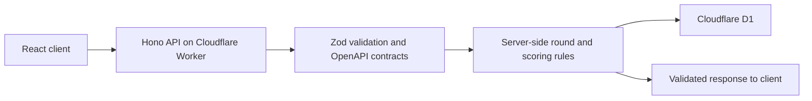

# Roundcraft

A practice tool for reading Counter-Strike 2 rounds. Players assess incomplete information, make a reasoned decision, then review the evidence behind it.

**Status:** In development. No public demo has been verified.

## Why it exists

Most browser games about Counter-Strike test memory or recognition. Roundcraft explores a question closer to an in-game decision: given what is known at that moment, which interpretation is defensible, and what evidence supports it?

## How it works

The React client communicates with an Hono API on a Cloudflare Worker. Zod validates input and API contracts. The server owns round state, attempts, and scoring. Cloudflare D1 persists the application data.



The project separates the client, server rules, and HTTP contracts. Examples of valid and invalid requests make API boundaries easier to verify.

## Engineering highlights

- **Server-authoritative scoring:** the client cannot decide the outcome or final score.
- **Explicit contracts:** schemas, error responses, and request examples document the API.
- **Persistent state:** D1 supports state that can survive beyond a single session.
- **Layered tests:** contracts, Worker, client, and browser flows have separate commands.
- **Deployment status is clear:** production deployment remains in development, so this README does not claim a public demo.

## Stack

TypeScript · React · Vite · Hono · Zod · Cloudflare Workers · Cloudflare D1 · Vitest · Playwright

## Run locally

Requires Node.js 22 or later.

```bash
npm ci
npm run db:migrate:local
npm run dev
```

Review `.dev.vars.example` before setting local variables. Do not commit credentials.

## Checks

```bash
npm test
npm run typecheck
npm run lint
npm run build
npm run test:e2e
```

`npm test` runs the contract, Worker, and client tests. The suite does not require a public deployment.
