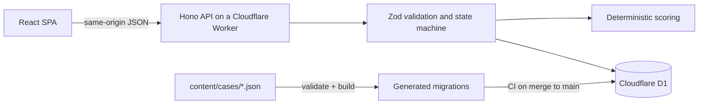

# Roundcraft

A practice tool for reading Counter-Strike 2 rounds. Players assess incomplete information, commit to a reasoned decision, adapt when the round changes, then review their line against what actually happened.

Designed and built by Duarte as an independent project.

**Status:** Closed-beta preparation. The game engine, API and content pipeline work end to end locally and are covered by automated tests. No public demo is available yet, and no case has completed human tactical review, so there is no playable production content. See [Current status](#current-status).

## Why it exists

Most browser games about Counter-Strike test memory, aim or recognition. Roundcraft explores a question closer to an in-game decision: given what is known at that moment, which interpretation is defensible, and what evidence supports it? The flagship format is one deep tactical case per release rather than many shallow puzzles.

## How a case plays

1. **Brief.** The round state, with every fact labelled by how current it is: *Confirmed*, *Last seen* (with an age), *Inferred* (with a basis) or *Unknown*.
2. **Evidence.** Pick the two signals that should carry the most weight.
3. **Main call.** Choose an action, a qualifier and a confidence level, then lock it. Locking is irreversible.
4. **Follow-up.** New information arrives. Hold or change the line, then lock again.
5. **Reveal and review.** *Your line* side by side with *What actually happened*, why the line scored as it did, and a closing *What to remember from this round*.

## Engineering highlights

- **Deterministic, server-only scoring.** 50 points for the main call, 20 for evidence and 30 for the follow-up. Scores are integers, computed only in the Worker from a server-side rubric, stored once and returned unchanged on refresh or retry. Confidence is recorded but never scored. No generative model is involved in official results.
- **Phase-gated disclosure.** Case content is stored as four separate projections: brief, follow-up, reveal and rubric. The browser receives the follow-up only after the main call is locked, and the reveal only after the follow-up is locked. The rubric never leaves the server. An end-to-end test inspects real network responses to enforce this.
- **One official attempt, safely.** An anonymous identity (an HMAC-verified `__Host-` cookie with CSRF protection) gets one official attempt per case. Commits use idempotency keys, `If-Match` sequence checks and conditional D1 updates, so retries, double clicks and concurrent tabs cannot create duplicate or out-of-order results. Before locking a main call, the server checks that every possible follow-up answer can be scored, so a content gap can never strand a player.
- **Contracts first.** OpenAPI 3.1, JSON Schemas, error codes and valid/invalid examples live in `contracts/`, and the client validates every response with Zod.
- **Content as code.** Cases are JSON files with an editorial status. A validator enforces schema, cross-reference, scoring-coverage, disclosure and honesty rules. A generator emits append-only, checksummed D1 migrations for cases marked ready. See [`content/README.md`](content/README.md).
- **Demo-grounded content mining.** An offline Python tool parses CS2 demos, keeps the demo's omniscient ground truth separate from what the deciding team could know, ranks decision points by editorial interest, and drafts cases for human review. See [`tools/case-miner`](tools/case-miner/README.md).
- **Diagnosable failures.** Structured JSON logs carry a request id shared with the error envelope. Cookies, tokens, IPs and player answers are never logged.
- **Accessible by default.** Keyboard shortcuts never lock a decision, and the shortcuts panel is a native modal dialog. Focus moves to each stage heading. Contrast meets WCAG AA in light and dark themes, and reduced motion is respected.

## Architecture



One modular Worker serves the API and the static client. There are no extra services or queues. Browser storage holds only the theme choice and in-progress drafts (IndexedDB).

## Stack

TypeScript · React 19 · Vite · Hono · Zod · Cloudflare Workers · Cloudflare D1 · Vitest (including the Workers pool) · Playwright

## Run locally

Requires Node.js 22.18 or later.

```bash
npm ci
cp .dev.vars.example .dev.vars          # then set a random IDENTITY_PEPPER
npm run content:preview -- case_smoke_001   # local D1: migrations + a technical fixture case
npm run dev
```

`case_smoke_001` is a generic technical fixture for trying the flow. It is not tactical content.

## Checks

```bash
npm run typecheck
npm run lint
npm run content:validate
npm test            # contract, content, Worker (real D1) and client tests
npm run build
npm run test:e2e    # includes a full official attempt against the real Worker and D1
```

CI runs all of these on every pull request. A merge to `main` applies D1 migrations and deploys.

## Current status

| Area | State |
|---|---|
| Game flow, API, scoring, disclosure, idempotency | Implemented and tested end to end locally |
| Content pipeline (author → validate → review → preview → build → withdraw) | Implemented |
| Production cases | None ready. Ten drafts mined from real demos and three older drafts await human tactical review |
| Case mining | Offline tool (`tools/case-miner`) turns CS2 demos into ranked decision candidates, player-known vs ground-truth diagrams and draft cases |
| Public deployment | A Worker and D1 database exist, but no public route or domain is configured and production holds no cases |
| Tactical diagrams | Not yet built. Cases are currently text-only |

## Limitations

- Case quality depends on qualified CS2 reviewers. The tooling enforces structure and consistency, not tactical truth.
- Deleting history frees the identity's official slot, so a determined player can replay an edition.
- Rate limiting is per IP and per route family, which can affect players behind a shared network.
