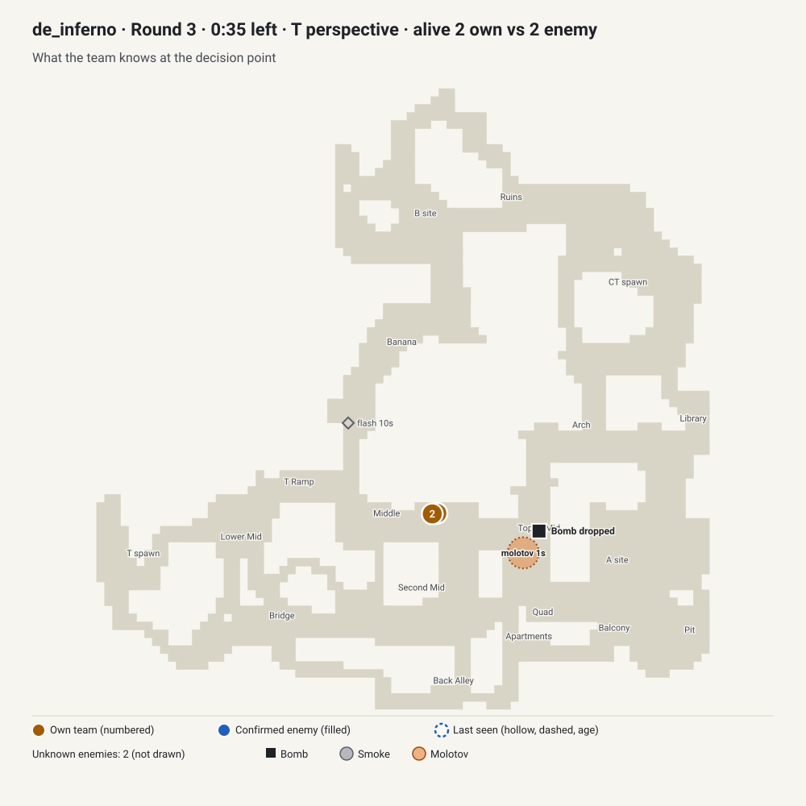
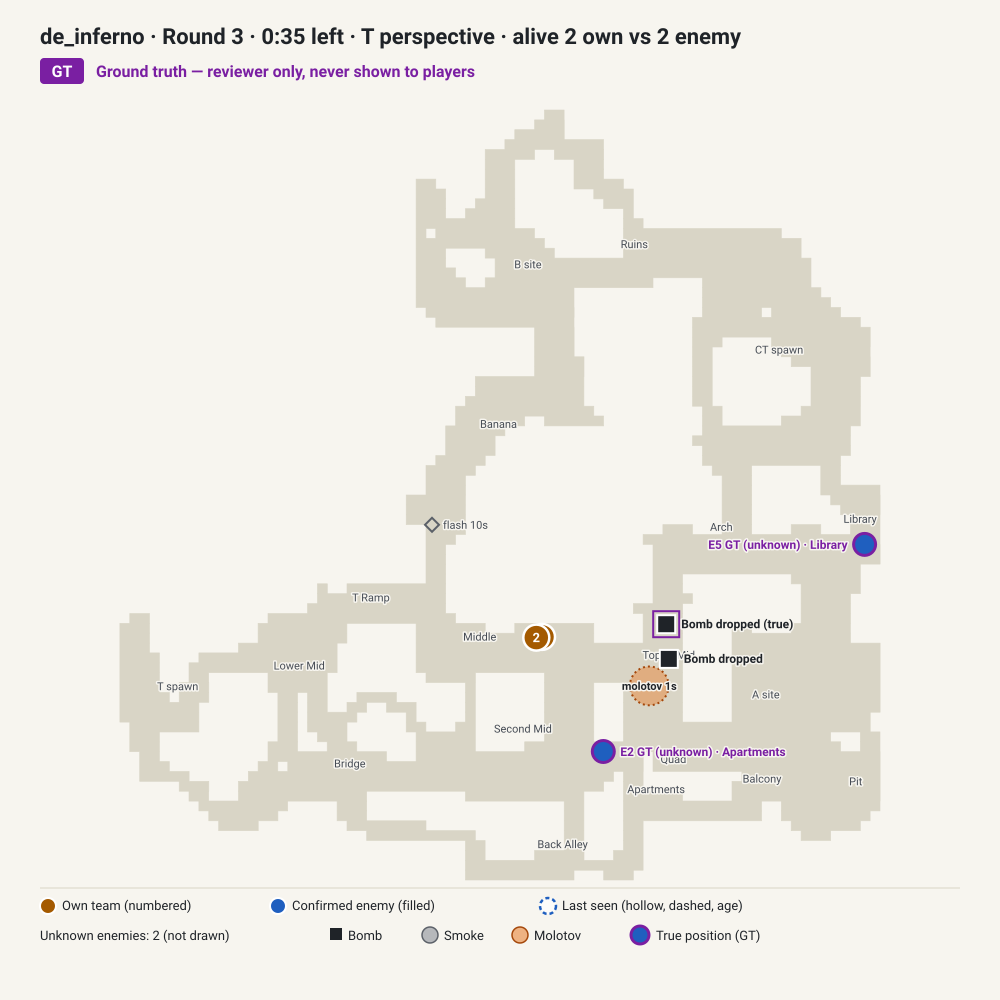

# Review packet: 2v2 with 35 s left and the bomb on the ground on Inferno

`case_inferno_late_round_no_plant_a430fd` · de_inferno · T side · status **draft** · recommendation **REVIEW FIRST**

Demo-grounded synthetic draft. Options, debrief and rubric are proposals generated from the source round; nothing here has had human tactical review. Time budget: 5–10 minutes.

Play it locally: `npm run content:preview -- case_inferno_late_round_no_plant_a430fd` then `npm run dev` and open Today.

## Why this case

Two attackers in Middle, both with AK-47s but one on 44 HP, have 35 seconds left and no plant. The bomb lies dropped in Top of Mid, about 700 units away, and both defenders are unknown. The dilemma is real: pick up the bomb and hit a site at once, take information first, or fake. The follow-up (a defender with an AK-47 appears in Arch about 11 seconds later) arrives close to the next fight, so its value as a second decision needs a human check.

## Tactical snapshot

| Player-known view (what the brief may use) | Ground truth (reviewer only, never shown to players) |
| --- | --- |
|  |  |

## Brief as the player sees it

- **confirmed** — You play the T side on Inferno.
- **confirmed** — The bomb has not been planted; about 35 s remain on the round clock.
- **confirmed** — The bomb is on the ground in Top of Mid.
- **confirmed** — 2 Ts alive against 2 CTs.
- **confirmed** — Your players: AK-47 + Glock-18, 94 HP, full armour; AK-47 + P2000, 44 HP, full armour.
- **confirmed** — Your team has 1 molotov left.
- **confirmed** — Score: your team 2, the defenders 0.
- **confirmed** — Your team is positioned: 2 in Middle.
- **unknown** — The positions of two defenders are unknown.

Evidence options (pick two): Round clock · Alive count · Own utility · Unknown defender positions · Own team positions

## Recent timeline before the decision (source round)

- `-18.7 s` A T player killed a CT player with an AK-47 (headshot) in Ruins
- `-10.2 s` A T player detonated a flash in Banana
- `-1.0 s` A T player detonated a molotov in Top of Mid

## Proposed lines and scoring (proposal, not truth)

| Action | Qualifier | Main-call quality (0–100) |
| --- | --- | --- |
| Commit to an execute now | Hit the site together and trade each entry | 100 |
| Commit to an execute now | Plant quickly and set up crossfires | 90 |
| Keep the default and take information first | Play slowly and listen for rotations | 75 |
| Keep the default and take information first | Probe with one player while the other holds | 65 |
| Fake one site, then rotate to the other | Sell the fake with utility | 50 |
| Fake one site, then rotate to the other | Fake quietly and rotate early | 40 |

Every combination scored with the production 50/20/30 model:

```
case_inferno_late_round_no_plant_a430fd: 240 combinations; min 40, p25 60, median 69, p75 78, max 98; 100s: 0
  best  98  Commit to an execute now / Hit the site together and trade each entry
  best  93  Commit to an execute now / Plant quickly and set up crossfires
  best  85  Keep the default and take information first / Play slowly and listen for rotations
  best  80  Keep the default and take information first / Probe with one player while the other holds
  best  73  Fake one site, then rotate to the other / Sell the fake with utility
  best  68  Fake one site, then rotate to the other / Fake quietly and rotate early
  follow-up    18 / 30  Stick to the line you chose
  follow-up     9 / 30  Drop the line you chose and reset
  follow-up    28 / 30  Change your line to use the new information
  follow-up 16-17 / 30  Slow down and gather more information
```

## Follow-up

A new sighting: About 11 seconds later, a defender appears in Arch.

- **new** — One defender is visible in Arch right now with an AK-47.
- **new** — The position of one defender is unknown.
- **changed** — About 24 seconds now remain on the round clock.

Responses and proposed follow-up quality: Change your line to use the new information = 92; Stick to the line you chose = 60; Slow down and gather more information = 55; Drop the line you chose and reset = 30

Follow-up caveats:

- The next kill follows 1.0 s after the new information.

## What happened in the source round (reveal, not the answer key)

In the source round, over the next 10 s: 2 players held position in Middle. Over the next 20 s the team used 1 molotov and got 1 kill and lost 1 player. The Ts won by eliminating the defenders; one of your team survived.

- `+3.4 s` A T player detonated a molotov in Apartments
- `+3.8 s` A CT player detonated a flash in Top of Mid
- `+5.3 s` A CT player detonated a flash in Middle
- `+12.0 s` A T player killed a CT player with an AK-47 in Arch
- `+12.6 s` A CT player killed a T player with an M4A1-S (headshot) in Middle
- `+17.2 s` A player picked up the bomb in Top of Mid
- `+22.9 s` A player began planting at A
- `+26.0 s` A player planted the bomb at A
- `+30.9 s` A T player killed a CT player with an AK-47 (headshot) in A site
- `+30.9 s` The attackers win: all defenders eliminated.

What to remember (proposed): Decide when to stop gathering information: keep reading while the clock is long and positions are unknown, and commit once the clock or the numbers force the plan.

## Assumptions that need judgement

- The draft treats "hit the site together" as the best line and a plant-then-crossfire as close behind; both rankings come from templates.
- The Arch sighting depends partly on where the source team walked; a team on another route might not see it at the same time.
- Retrieving the dropped bomb is folded into the action rather than offered as its own choice.
- Team comms may have provided information the demo cannot show (callouts, sound cues, teammates' kill positions).
- The historical line is not assumed to be correct; it only records what this team did.
- Sightings come from the demo's spotted flag, which can register enemies a player never consciously noticed.
- Detected by a heuristic; not yet reviewed by a human CS2 reviewer.
- Late round with no plant: the attackers' options depend on how much of the round clock they are willing to spend, which is a judgement call.
- The follow-up information arrives less than 2 s before the next kill, leaving almost no time to react.
- The follow-up is the first material change the demo shows 3-25 s later; teams may have learned of it earlier through comms.
- Follow-up reaction window is only 0.98 s: in the source round the situation changed again almost at once, so the responses may not be meaningfully playable. Confirm the window is long enough or author a different follow-up.

## Questions for the reviewer

1. With the bomb about 700 units away and 35 s left, is committing now clearly best, or can a 2v2 with one player on 44 HP be played slower?
2. Which site does "the site" mean here, and can B be reached in time from Middle after picking up the bomb?
3. Is a fake with two players and one molotov ever playable at 35 s, or should it score as clearly wrong?
4. Should picking up the bomb be an explicit option, or is it implied by every attacking line?
5. Does the Arch sighting work as a follow-up for every line, or only for the route the source team took?
6. Is the 44 HP player relevant enough to change the ranking?

## Your verdict

Answer the questions above in a sentence each, then record the review in the case file:

```json
"reviewers": [{ "name": "<your name>", "reviewedAt": "YYYY-MM-DD", "verdict": "approved | changes_requested", "notes": "<answers and required edits>" }]
```

Only a named human CS2 reviewer can approve. `approved` plus `status: "tactically_reviewed"` is the next step; `changes_requested` keeps it as a draft.
