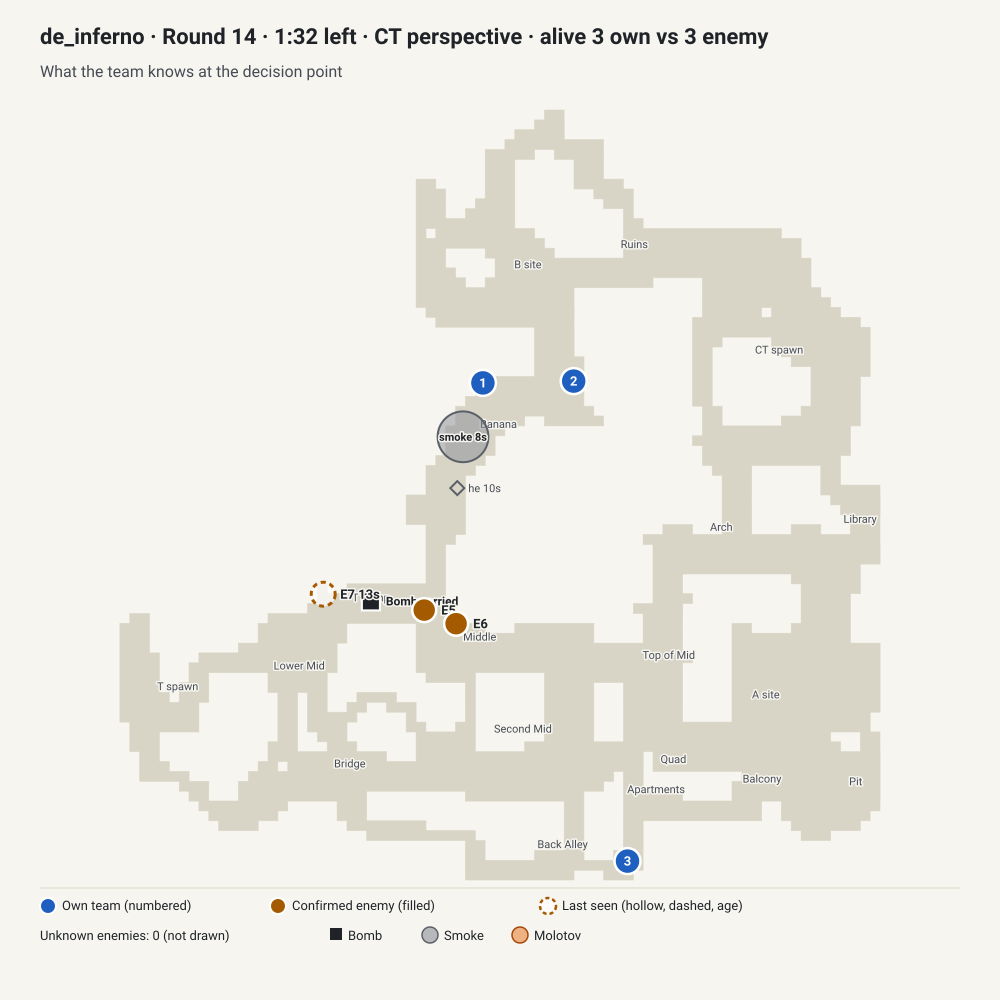
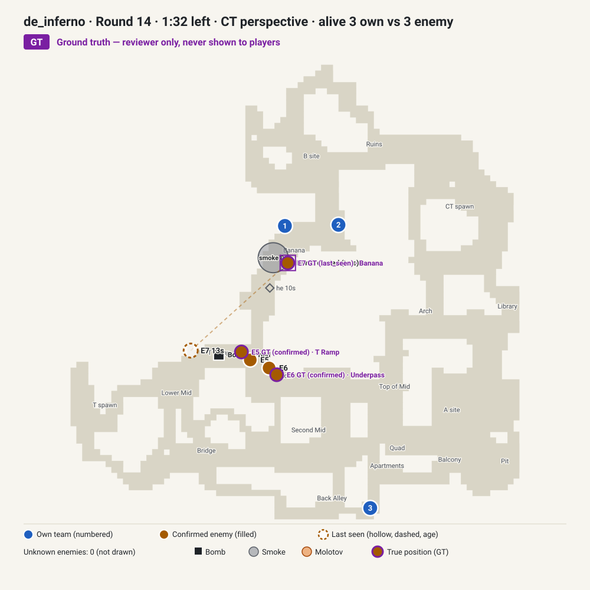

# Review packet: 3v3 hold or rotate as the defenders on Inferno

`case_inferno_man_advantage_shift_927fb7` · status **draft** · queue: **NEEDS TACTICAL DECISION** · about 5–10 minutes

A synthetic case built from a decision point in a recorded round. The options, scores and debrief are proposals from the draft generator; nothing here has had human tactical review. You do not need the demo or the case JSON.

To play it locally: `npm run content:preview -- case_inferno_man_advantage_shift_927fb7`, then `npm run dev`, and open Today.

**In one paragraph.** Three defenders (two in Banana, one in Apartments) with SMGs and a FAMAS face three attackers 22 seconds into the round, with no plant, 92 seconds left and an 11-2 lead. A trade has just happened in Middle: an attacker died there 1.8 seconds ago and a teammate 1.4 seconds ago, to a Desert Eagle. Two attackers were seen 1.5 seconds ago, one in Middle and one in T Ramp, and the bomb carrier was last seen in T Ramp 13 seconds ago. The question is whether to hold the current split or rotate a player. The follow-up, the carrier appearing in Banana, is a genuine enemy-side move, but the draft's best line rotates a player towards Middle, away from Banana.

## 1. Situation

| | |
| --- | --- |
| Map | Inferno |
| Side | CT (defenders) |
| Score and match context | Score: your team 11, the attackers 2. |
| Time | The bomb has not been planted; about 92 s remain on the round clock. |
| Alive | 3 CTs alive against 3 Ts. |
| Weapons and armour | Your players: MP9 + USP-S, 100 HP, full armour; MP9 + USP-S, 100 HP, full armour; FAMAS + Dual Berettas, 100 HP, full armour. |
| Utility and defuse kits | 1 of your 3 alive players carries a defuse kit. Your team has 1 smoke, 4 flashes, 2 molotovs and 1 HE grenade left. |
| Bomb | The bomb carrier was last seen in T Ramp 13 s ago with a Desert Eagle. |
| Your positions | Your team is positioned: 2 in Banana, 1 in Apartments. |

## 2. What the deciding team knew

| Player-known view (all the brief may use) | Ground truth (reviewer only, never shown to players) |
| --- | --- |
|  |  |

**Confirmed**
- One attacker was spotted in Middle 1.5 s ago with a Desert Eagle.
- One attacker was spotted in T Ramp 1.5 s ago with a Desert Eagle.
- An attacker was killed in Middle 1.8 s ago.
- A teammate was killed in Middle 1.4 s ago by a Desert Eagle.

**Last seen (with age)**
- The bomb carrier was last seen in T Ramp 13 s ago with a Desert Eagle.

**Inferred**
- None.

**Unknown**
- None.

<details><summary>Last 20 s of the source round before the decision (reviewer context, includes events the team could not see)</summary>

- `-13.4 s` A CT player killed a T player with an M4A1-S in T Ramp
- `-10.5 s` A CT player detonated an HE grenade in Banana
- `-7.9 s` A CT player detonated a smoke in Banana
- `-6.3 s` A T player detonated a flash in Banana
- `-1.8 s` A CT player killed a T player with an M4A1-S (headshot) in Middle
- `-1.4 s` A T player killed a CT player with a Desert Eagle in Middle

</details>

## 3. Main decision

The player picks one action, one way to execute it and a confidence level (confidence is never scored).

| Action | Ways to execute it (proposed main-call quality, 0–100) | Proposed tier: the rule behind it |
| --- | --- | --- |
| Rotate a player towards Middle | Rotate one player and keep the rest in place (100); Rotate two players and leave one behind (90) | best: a fresh sighting and enough clock: shifting weight to it is the proposed lead |
| Take information before committing | Listen and read footsteps before moving (75); Probe with a trade behind the prober (65) | good: long clock: information is affordable |
| Hold the current setup | Stay in the set positions and trade (75); Use utility to delay the first contact (65) | good: attackers partly located: holding remains defensible |
| Fall back and play for a retake if they plant | Fall back together and regroup (50); Fall back but hold one angle (40) | fair: level or better on numbers: giving up a site is rarely necessary |

**How the main call and evidence score**

- Main call, up to 50 points: half the line's quality above. Each line is rated on position choice (60%) and information use (40%).
- Evidence, up to 20 points: the player picks two of "Attacker spotted in Middle", "Attacker spotted in T Ramp", "Round clock", "Alive count", "Own utility". Each pair has proposed points for each action:

| Action | Highest-scoring pairs | Lowest-scoring pair |
| --- | --- | --- |
| Rotate a player towards Middle | Attacker spotted in Middle + Attacker spotted in T Ramp (20); Attacker spotted in Middle + Round clock (18) | Alive count + Own utility (12) |
| Take information before committing | Attacker spotted in Middle + Attacker spotted in T Ramp (20); Alive count + Attacker spotted in Middle (18) | Own utility + Round clock (14) |
| Hold the current setup | Attacker spotted in Middle + Attacker spotted in T Ramp (20); Alive count + Attacker spotted in Middle (18) | Own utility + Round clock (14) |
| Fall back and play for a retake if they plant | Alive count + Attacker spotted in Middle (20); Alive count + Attacker spotted in T Ramp (20) | Own utility + Round clock (12) |

**Why more than one line may be defensible**

- Rotate a player towards Middle (best line 100): a fresh sighting and enough clock: shifting weight to it is the proposed lead.
- Take information before committing (best line 75): long clock: information is affordable.
- Hold the current setup (best line 75): attackers partly located: holding remains defensible.
- The draft's debrief names the strongest alternative: The closest alternative was to hold the current setup, keeping trades in place at the cost of the initiative.

## 4. Follow-up

**A new sighting**: About 13 seconds later, the bomb carrier appears in Banana.

- new: The bomb carrier is visible in Banana right now with a Desert Eagle.
- changed: About 80 seconds now remain on the round clock.

**Timing**

- The new information arrives 13.0 s after the decision.
- Reaction window: the next kill in the source round comes 1.45 s after the new information — almost no time to act on it.
- It depends on the source team's own movement: a team on another line might not have seen it.

**Follow-up score matrix** (proposed quality 0–100; worth up to 30 points): rows are the action the player locked, columns the answer they give now.

| Locked action | Hold and take more information | Fall back and set up for a retake | Shift a player towards the latest contact | Keep the current setup |
| --- | --- | --- | --- | --- |
| Take information before committing | 75 | 30 | 80 | 65 |
| Hold the current setup | 65 | 30 | 80 | 75 |
| Rotate a player towards Middle | 55 | 20 | 100 | 55 |
| Fall back and play for a retake if they plant | 55 | 50 | 70 | 55 |

How the draft built it: each cell is the value of the answer's line after the update, minus a switching cost (10 within the same posture, 20 one step apart, 30 between passive and active; nothing for staying). Under the draft's rules the update leaves the strongest line unchanged: before, Rotate a player towards Middle; after, Rotate a player towards Middle.

Totals for named lines (best way to execute and best evidence pair for each action):

```
  good main -> stays with it               100  (follow-up 30/30: Rotate a player towards Middle -> Shift a player towards the latest contact)
  good main -> unnecessary reversal         87  (follow-up 17/30: Rotate a player towards Middle -> Hold and take more information)
  weak main -> best correction              66  (follow-up 21/30: Fall back and play for a retake if they plant -> Shift a player towards the latest contact)
  weak main -> stubborn continuation        60  (follow-up 15/30: Fall back and play for a retake if they plant -> Fall back and set up for a retake)
  plausible alternative -> stays with it    80  (follow-up 22/30: Take information before committing -> Hold and take more information)
```

## 5. What actually happened

> Descriptive only. This is what one team did in one recorded round. It is not the answer key, and the scoring above was not built from it.

In the source round, over the next 10 s: 2 players held position in Banana; 1 player moved from Apartments to Second Mid. Over the next 20 s the team used 1 HE grenade, 1 molotov and got 1 kill and lost 2 players. The Ts won by eliminating the defenders; none of your team survived.

- `+1 s` In the source round, a CT player threw an HE grenade that detonated in Banana.
- `+10 s` A CT player threw a molotov that detonated in Banana.
- `+14 s` A T player dropped the bomb in Banana.
- `+14 s` A CT player killed a T player with an MP9 in Banana.
- `+15 s` A T player killed a CT player with a Desert Eagle in Banana.
- `+18 s` A T player killed a CT player with a Desert Eagle (headshot) in Banana.
- `+20 s` A CT player killed a T player with a FAMAS in Middle.
- `+22 s` A T player killed a CT player with a Desert Eagle (headshot) in Underpass.
- `+22 s` The round ended: the Ts won by eliminating the defenders.

Takeaway the draft proposes ("What to remember"): *Move weight only for information you trust: a fresh sighting justifies a rotation, an old or unconfirmed one usually does not.*

## 6. Questions for the reviewer

1. Once the bomb carrier appears in Banana, which line should score best for each locked call: keep a player moving towards Middle, keep the setup, or take more information? The draft's answer (Middle) ignores where the carrier is.
2. With the carrier last seen in T Ramp 13 s ago and two fresh sightings in Middle and T Ramp, is rotating a player away from Banana sensible, or should Banana stay stacked?
3. A teammate has just died in Middle to a Desert Eagle: does that argue for sending a player towards Middle, or against it?
4. Is "towards Middle" meaningful for the Apartments player, or should the option name a specific position?
5. Is "fall back" ever a real option at 3v3 with no plant and 92 s left?
6. Once the carrier appears in Banana, is keeping the setup really worse than adjusting it?
7. Do Desert Eagle attackers indicate an eco or a force buy, and should the brief say so?
8. Are "rotate one" and "rotate two" meaningfully different at 3v3?

Assumptions the draft makes that you may want to challenge:

- The draft's best line (rotate one player towards Middle) comes from a template. The source team held Banana and killed the carrier there.
- The follow-up is only visible to a team that still has players in Banana.
- The attackers' pistols suggest an eco or a force buy, but the brief does not state their economy.
- Follow-up matrix: the draft's priors do not weigh where a sighting is relative to the team, so after the carrier appears in Banana they still rate moving a player towards Middle as the strongest line (100) and holding as 75. A reviewer must set this row by hand.

## 7. Approval form

Copy this section into your reply, or fill it in here. One line per answer is enough.

- **Are the main options realistic for this moment?** ☐ Yes ☐ No
  Changes: ______________________

- **Best-supported line:** ______________________ (agree with the draft's ☐ / different ☐)

- **Other defensible lines:** ______________________

- **Is the evidence weighting fair?** ☐ Yes ☐ No
  Changes: ______________________

- **Is the follow-up realistic (it could plausibly reach a team on any line)?** ☐ Yes ☐ No
  Changes: ______________________

- **Is the follow-up score matrix fair?** ☐ Yes ☐ No
  Rows or cells to change: ______________________

- **Are callouts, timings and numbers correct?** ☐ Yes ☐ No
  Corrections: ______________________

- **Is the takeaway ("What to remember") correct and transferable?** ☐ Yes ☐ No
  Rewrite: ______________________

- **Verdict:** ☐ Approve ☐ Changes requested
- **Reviewer name and date:** ______________________

The case owner records the verdict in the case file, so the reviewer does not need to touch JSON:

```json
"reviewers": [{ "name": "<reviewer>", "reviewedAt": "YYYY-MM-DD", "verdict": "approved | changes_requested", "notes": "<answers above>" }]
```

Only a named human CS2 reviewer can approve. `approved` lets the owner move `case_inferno_man_advantage_shift_927fb7` to `tactically_reviewed`; `changes_requested` keeps it a draft.
