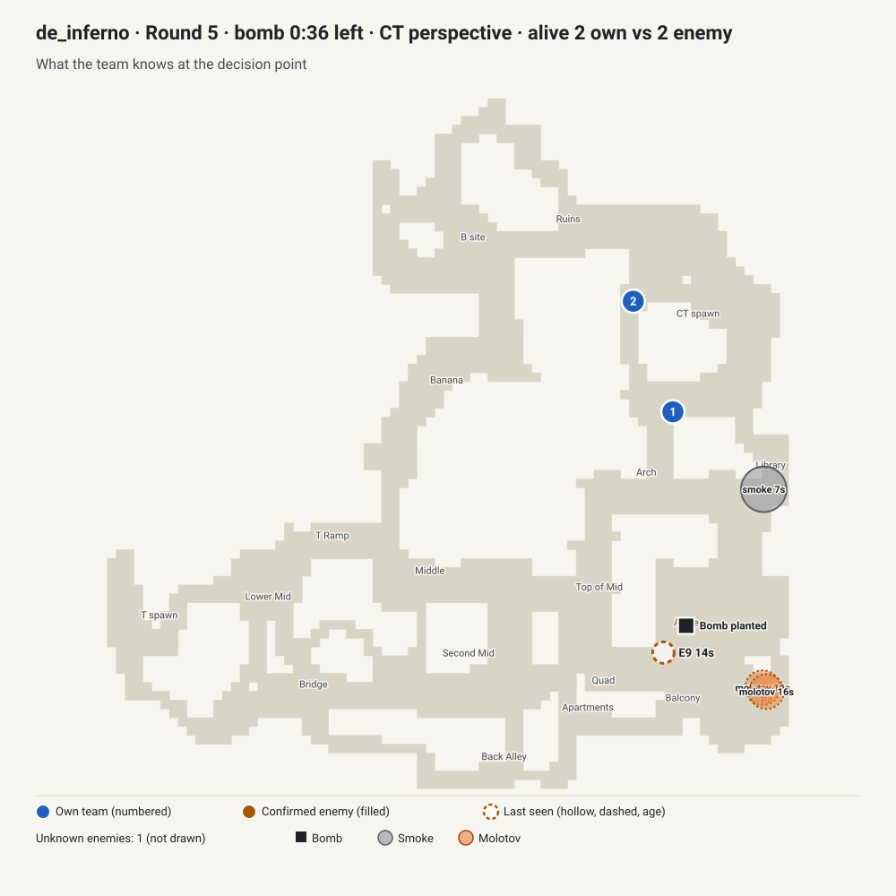
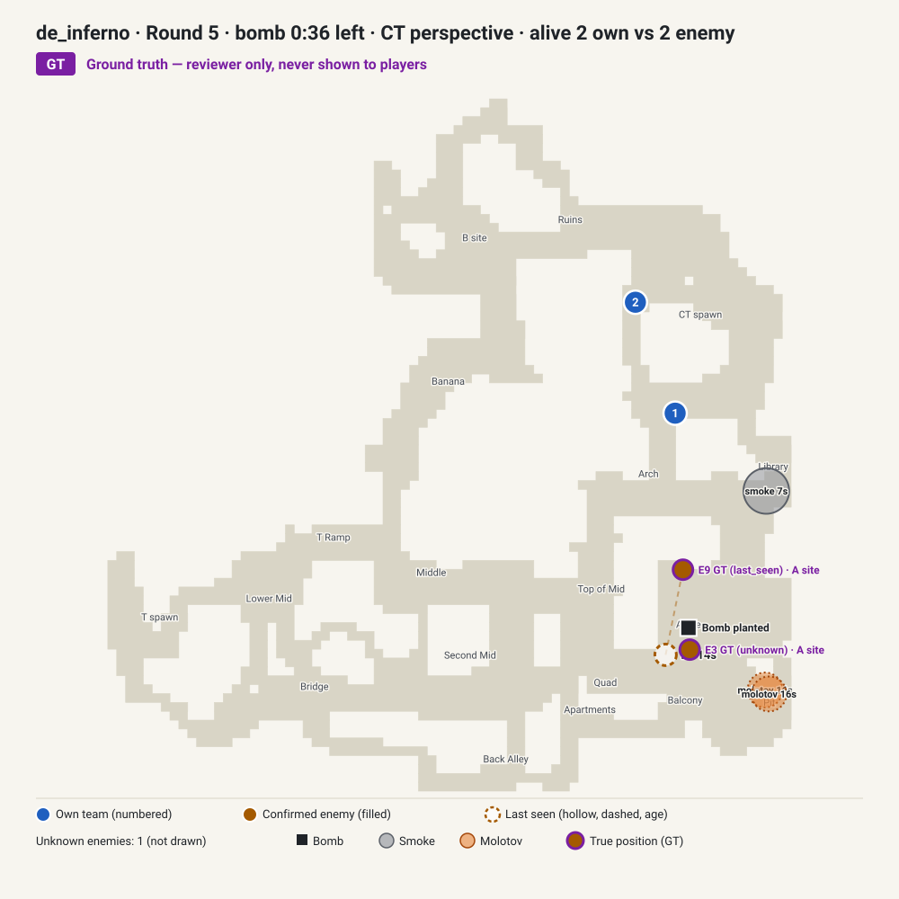

# Review packet: 2v2 retake at A on Inferno

`case_inferno_post_plant_356758` · status **draft** · queue: **REVIEW FIRST** · about 5–10 minutes

A synthetic case built from a decision point in a recorded round. The options, scores and debrief are proposals from the draft generator; nothing here has had human tactical review. You do not need the demo or the case JSON.

To play it locally: `npm run content:preview -- case_inferno_post_plant_356758`, then `npm run dev`, and open Today.

**In one paragraph.** Two defenders in CT Spawn face a bomb planted at A about 4 seconds earlier, 36 seconds before detonation. Both carry defuse kits and full armour but no utility. One attacker with an AK-47 was last seen in A site 14 seconds ago; the planter is unknown. It is the cleanest brief in the set: every fact comes from what the defenders could know. The follow-up (an enemy smoke in Balcony) is an attacker action, although a team that stayed in CT Spawn might not have seen it. The open question is the classic one: retake together now, or wait and commit late to a kit defuse.

## 1. Situation

| | |
| --- | --- |
| Map | Inferno |
| Side | CT (defenders) |
| Score and match context | Score: your team 0, the attackers 4. |
| Time | 36 s left on the bomb timer (once planted, the round clock no longer applies). |
| Alive | 2 CTs alive against 2 Ts. |
| Weapons and armour | Your players: AWP + USP-S, 100 HP, full armour; M4A1-S + P2000, 100 HP, full armour. |
| Utility and defuse kits | 2 of your 2 alive players carry a defuse kit. Your team has no utility left. |
| Bomb | The bomb is planted at A; 36 s remain on the bomb timer. |
| Your positions | Your team is positioned: 2 in CT Spawn. |

## 2. What the deciding team knew

| Player-known view (all the brief may use) | Ground truth (reviewer only, never shown to players) |
| --- | --- |
|  |  |

**Confirmed**
- The attackers detonated two molotovs in Pit 16 s ago.
- The attackers detonated a smoke in Library 7 s ago.

**Last seen (with age)**
- One attacker was last seen in A site 14 s ago with an AK-47.

**Inferred**
- The bomb was planted 4 s ago, so at least one attacker was at site A moments ago. Basis: plant announcement.

**Unknown**
- The position of one attacker is unknown.

<details><summary>Last 20 s of the source round before the decision (reviewer context, includes events the team could not see)</summary>

- `-16.1 s` A T player detonated a molotov in Pit
- `-16.0 s` A T player detonated a molotov in Pit
- `-15.5 s` A CT player killed a T player with an M4A4 in A site
- `-15.4 s` A T player died from world damage
- `-14.3 s` A T player killed a CT player with an AK-47 in Pit
- `-6.9 s` A player began planting at A
- `-6.7 s` A T player detonated a smoke in Library
- `-3.8 s` A player planted the bomb at A

</details>

## 3. Main decision

The player picks one action, one way to execute it and a confidence level (confidence is never scored).

| Action | Ways to execute it (proposed main-call quality, 0–100) | Proposed tier: the rule behind it |
| --- | --- | --- |
| Retake together, clearing A site first | Clear the known position together and trade the first contact (100); Move as one stack and trade every contact (90); Send one player ahead to probe while the other follows (75) | best: numbers level or better, or -1 with a comfortable clock: group retake is the proposed lead |
| Wait for information before committing | Hold back and go for a late defuse (75); Listen for footsteps before moving (65) | good: at least one enemy is unlocated and the clock is long: information has real value |
| Save the weapons | Everyone saves and avoids contact (25); Save, but take a trade if an attacker is met (15) | poor: numbers level or better and a comfortable clock: saving gives away a winnable round |

**How the main call and evidence score**

- Main call, up to 50 points: half the line's quality above. Each line is rated on commitment timing (60%) and information use (40%).
- Evidence, up to 20 points: the player picks two of "Bomb timer", "Alive count", "Attacker last seen in A site", "Own utility", "Defuse kit availability". Each pair has proposed points for each action:

| Action | Highest-scoring pairs | Lowest-scoring pair |
| --- | --- | --- |
| Retake together, clearing A site first | Bomb timer + Attacker last seen in A site (20); Alive count + Bomb timer (18) | Defuse kit availability + Own utility (14) |
| Wait for information before committing | Alive count + Bomb timer (20); Bomb timer + Attacker last seen in A site (20) | Defuse kit availability + Own utility (13) |
| Save the weapons | Alive count + Bomb timer (20); Alive count + Defuse kit availability (16) | Attacker last seen in A site + Own utility (6) |

**Why more than one line may be defensible**

- Retake together, clearing A site first (best line 100): numbers level or better, or -1 with a comfortable clock: group retake is the proposed lead.
- Wait for information before committing (best line 75): at least one enemy is unlocated and the clock is long: information has real value.
- The draft's debrief names the strongest alternative: The closest alternative was to wait for information first, accepting less time on the bomb for a better read on positions.

## 4. Follow-up

**New enemy utility**: About 10 seconds later, the attackers detonate a smoke in Balcony.

- new: The attackers set off a smoke in Balcony just now.
- changed: About 26 seconds now remain on the bomb timer.

**Timing**

- The new information arrives 10.2 s after the decision.
- Reaction window: the next kill in the source round comes 6.14 s after the new information.
- It depends on the source team's own movement: a team on another line might not have seen it.

**Follow-up score matrix** (proposed quality 0–100; worth up to 30 points): rows are the action the player locked, columns the answer they give now.

| Locked action | Hold off and keep gathering information | Go into the retake together now | Save the weapons from here |
| --- | --- | --- | --- |
| Wait for information before committing | 50 | 80 | 5 |
| Retake together, clearing A site first | 30 | 100 | 0 |
| Save the weapons | 30 | 70 | 25 |

How the draft built it: each cell is the value of the answer's line after the update, minus a switching cost (10 within the same posture, 20 one step apart, 30 between passive and active; nothing for staying). Under the draft's rules the update leaves the strongest line unchanged: before, Retake together, clearing A site first; after, Retake together, clearing A site first.

Totals for named lines (best way to execute and best evidence pair for each action):

```
  good main -> stays with it               100  (follow-up 30/30: Retake together, clearing A site first -> Go into the retake together now)
  good main -> unnecessary reversal         79  (follow-up  9/30: Retake together, clearing A site first -> Hold off and keep gathering information)
  weak main -> best correction              54  (follow-up 21/30: Save the weapons -> Go into the retake together now)
  weak main -> stubborn continuation        40  (follow-up  7/30: Save the weapons -> Save the weapons from here)
  plausible alternative -> stays with it    73  (follow-up 15/30: Wait for information before committing -> Hold off and keep gathering information)
```

## 5. What actually happened

> Descriptive only. This is what one team did in one recorded round. It is not the answer key, and the scoring above was not built from it.

In the source round, over the next 10 s: 2 players moved from CT Spawn to Arch. Over the next 20 s the team used no utility and got 1 kill and lost no players. Defuses began 23 s and 28 s after the decision; none was completed. The Ts won by eliminating the defenders; none of your team survived.

- `+10 s` In the source round, a T player threw a smoke that detonated in Balcony.
- `+16 s` A CT player killed a T player with an M4A1-S (headshot) in Pit.
- `+23 s` A CT player began defusing at A.
- `+28 s` A CT player began defusing at A.
- `+28 s` A T player killed a CT player with an AK-47 (headshot) in A site.
- `+32 s` A T player killed a CT player with a Glock-18 in Graveyard.
- `+32 s` The round ended: the Ts won by eliminating the defenders.

Takeaway the draft proposes ("What to remember"): *On a retake, weigh the seconds a defuse needs against what you actually know: commit while the clock and the numbers support it, and save when they do not.*

## 6. Questions for the reviewer

1. Two kits, full armour, no utility, 36 s left, one AK-47 last seen in A site and one unknown attacker: is a quick grouped retake or a late kit defuse the better line? Are both defensible?
2. Is saving the AWP and the M4A1-S a defensible line at 2v2 with 36 s left, or should it score as a clear mistake?
3. Which entrance does "retake together" realistically use from CT Spawn: Arch, Library (smoked 7 s ago) or another?
4. Does a Balcony smoke 10 s later change what a two-player retake should do, or does it only confirm that the attackers hold A?
5. Is "hold back and commit late to a kit defuse" a real line with 36 s left, and by when must it start?
6. Is an AWP a liability in a close A-site retake, and should the brief or rubric say so?
7. After the Balcony smoke, with 26 s left and two kits, is a team that waited still in time to retake (the draft gives 80 for going in now), and is waiting on really as weak as 50?

Assumptions the draft makes that you may want to challenge:

- The draft ranks a grouped retake above a late kit defuse. That ranking comes from a generic retake template, not from this round's history (the source team retook together and lost).
- The Balcony smoke is only observable if the defenders have moved towards A; a team that waits in CT Spawn might not see it.
- Neither the AWP nor the lack of utility changes the ranking in the current rubric.
- Follow-up matrix: the Balcony smoke leaves the grouped retake strongest (staying with it scores 100). A team that waited is credited 80 for going in now and 50 for waiting on, because only 26 s remain.

## 7. Approval form

Copy this section into your reply, or fill it in here. One line per answer is enough.

- **Are the main options realistic for this moment?** ☐ Yes ☐ No
  Changes: ______________________

- **Best-supported line:** ______________________ (agree with the draft's ☐ / different ☐)

- **Other defensible lines:** ______________________

- **Is the evidence weighting fair?** ☐ Yes ☐ No
  Changes: ______________________

- **Is the follow-up realistic (it could plausibly reach a team on any line)?** ☐ Yes ☐ No
  Changes: ______________________

- **Is the follow-up score matrix fair?** ☐ Yes ☐ No
  Rows or cells to change: ______________________

- **Are callouts, timings and numbers correct?** ☐ Yes ☐ No
  Corrections: ______________________

- **Is the takeaway ("What to remember") correct and transferable?** ☐ Yes ☐ No
  Rewrite: ______________________

- **Verdict:** ☐ Approve ☐ Changes requested
- **Reviewer name and date:** ______________________

The case owner records the verdict in the case file, so the reviewer does not need to touch JSON:

```json
"reviewers": [{ "name": "<reviewer>", "reviewedAt": "YYYY-MM-DD", "verdict": "approved | changes_requested", "notes": "<answers above>" }]
```

Only a named human CS2 reviewer can approve. `approved` lets the owner move `case_inferno_post_plant_356758` to `tactically_reviewed`; `changes_requested` keeps it a draft.
