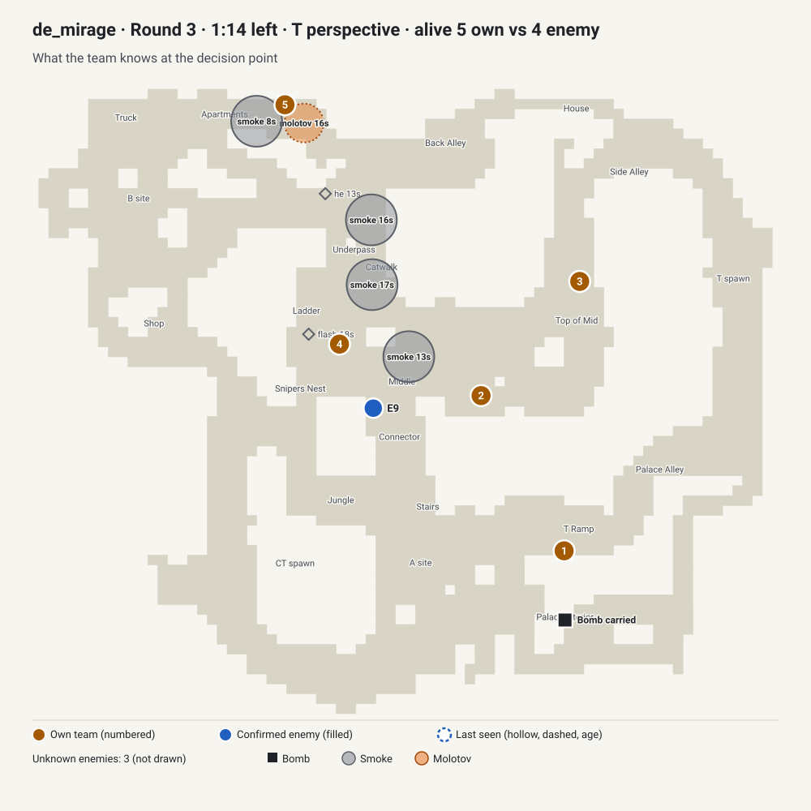
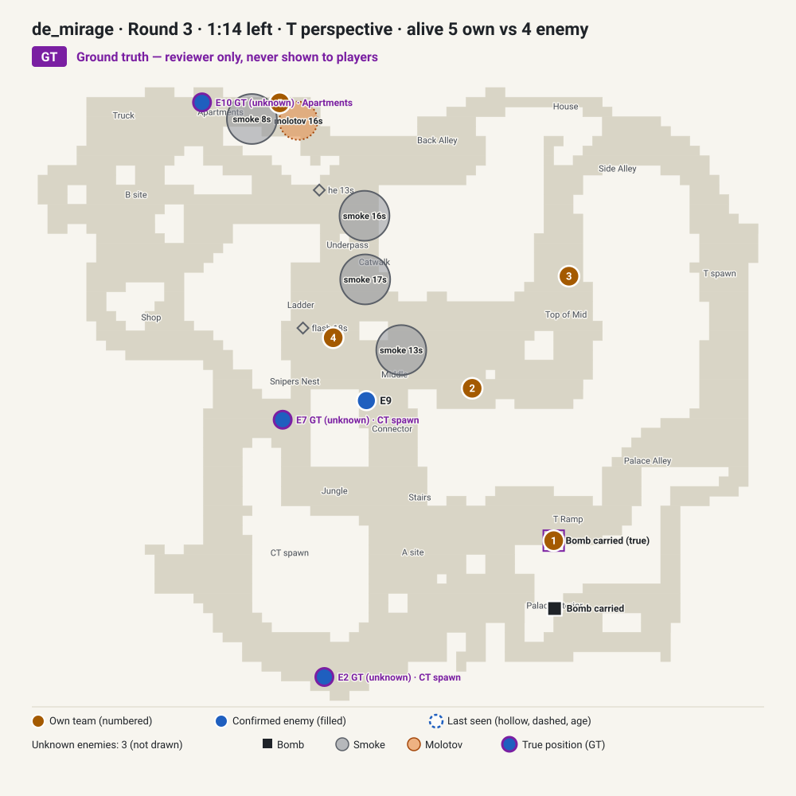

# Review packet: 5v4 with 74 s left and no plant on Mirage

`case_mirage_opening_pick_cae8a3` · status **draft** · queue: **REVIEW FIRST** · about 5–10 minutes

A synthetic case built from a decision point in a recorded round. The options, scores and debrief are proposals from the draft generator; nothing here has had human tactical review. You do not need the demo or the case JSON.

To play it locally: `npm run content:preview -- case_mirage_opening_pick_cae8a3`, then `npm run dev`, and open Today.

**In one paragraph.** Five attackers with SMGs and a scout lead 5v4 after an opening kill, 40 seconds into the round, carrying the bomb in Palace. One defender with a FAMAS is visible in Middle; three are unknown, with recent defender smokes and a molotov in Apartments. The first call is a posture choice (default, lurk, fake or execute). The follow-up is where this case earns its place: a second defender appears in Underpass, and with two of four defenders located the draft's strongest line flips from playing slowly to executing now. It is the one case in the queue where the follow-up tests a genuine change of mind, so the reviewer needs to decide whether that flip is right.

## 1. Situation

| | |
| --- | --- |
| Map | Mirage |
| Side | T (attackers) |
| Score and match context | Score: your team 1, the defenders 1. |
| Time | The bomb has not been planted; about 74 s remain on the round clock. |
| Alive | 5 Ts alive against 4 CTs. |
| Weapons and armour | Your players have 100, 100, 74, 48, 1 HP; two AK-47s, two MAC-10s, one SSG 08; four armoured. |
| Utility and defuse kits | Your team has 1 smoke and 5 flashes left. |
| Bomb | Your team is carrying the bomb in Palace Interior. |
| Your positions | Your team is positioned: 2 in Middle, 1 in Apartments, 1 in Palace Interior, 1 in Top of Mid. |

## 2. What the deciding team knew

| Player-known view (all the brief may use) | Ground truth (reviewer only, never shown to players) |
| --- | --- |
|  |  |

**Confirmed**
- The defenders detonated a molotov in Apartments 16 s ago.
- The defenders detonated a smoke in Apartments 8 s ago.
- The defenders detonated a smoke in Middle 13 s ago.
- One defender is visible in Middle right now with a FAMAS.
- A defender was killed in Ladder 1.9 s ago.

**Last seen (with age)**
- None.

**Inferred**
- None.

**Unknown**
- The positions of three defenders are unknown.

<details><summary>Last 20 s of the source round before the decision (reviewer context, includes events the team could not see)</summary>

- `-19.5 s` A CT player detonated an HE grenade in Apartments
- `-17.6 s` A T player detonated a flash in Ladder
- `-17.4 s` A T player detonated a smoke in Catwalk
- `-16.2 s` A CT player detonated a flash in Middle
- `-16.0 s` A CT player detonated a molotov in Apartments
- `-16.0 s` A T player detonated a smoke in Catwalk
- `-12.9 s` A T player detonated an HE grenade in Catwalk
- `-12.9 s` A CT player detonated a smoke in Middle
- `-8.5 s` A CT player detonated a smoke in Apartments
- `-8.4 s` A CT player detonated an HE grenade in Palace Interior
- `-1.9 s` A T player killed a CT player with a MAC-10 (headshot) in Ladder

</details>

## 3. Main decision

The player picks one action, one way to execute it and a confidence level (confidence is never scored).

| Action | Ways to execute it (proposed main-call quality, 0–100) | Proposed tier: the rule behind it |
| --- | --- | --- |
| Keep the default and take information first | Play slowly and listen for rotations (100); Probe the nearest known contact (90) | best: plenty of clock and few enemies located: information has the most value |
| Use a lone lurker to pull a rotation | Send one player alone behind the defence (75); Send two players wide with a trade (65) | good: level or better on numbers with 30+ s of clock: a lurk can pull a rotation |
| Fake one site, then rotate to the other | Sell the fake with utility (75); Fake quietly and rotate early (65) | good: long clock and utility to spend on a fake |
| Commit to an execute now | Use utility together to take space (50); Keep some utility back for the post-plant (40) | fair: plenty of clock and little information: committing early spends the options |

**How the main call and evidence score**

- Main call, up to 50 points: half the line's quality above. Each line is rated on commitment timing (60%) and utility use (40%).
- Evidence, up to 20 points: the player picks two of "Round clock", "Alive count", "Defender spotted in Middle", "Own utility", "Unknown defender positions". Each pair has proposed points for each action:

| Action | Highest-scoring pairs | Lowest-scoring pair |
| --- | --- | --- |
| Keep the default and take information first | Unknown defender positions + Round clock (20); Alive count + Unknown defender positions (18) | Defender spotted in Middle + Own utility (16) |
| Use a lone lurker to pull a rotation | Alive count + Own utility (20); Alive count + Round clock (20) | Defender spotted in Middle + Unknown defender positions (15) |
| Fake one site, then rotate to the other | Alive count + Round clock (20); Defender spotted in Middle + Round clock (20) | Unknown defender positions + Own utility (16) |
| Commit to an execute now | Own utility + Round clock (20); Alive count + Own utility (18) | Defender spotted in Middle + Unknown defender positions (14) |

**Why more than one line may be defensible**

- Keep the default and take information first (best line 100): plenty of clock and few enemies located: information has the most value.
- Use a lone lurker to pull a rotation (best line 75): level or better on numbers with 30+ s of clock: a lurk can pull a rotation.
- Fake one site, then rotate to the other (best line 75): long clock and utility to spend on a fake.
- The draft's debrief names the strongest alternative: The closest alternative was to fake one site and rotate, spending clock and utility to pull defenders out of position.

## 4. Follow-up

**A new sighting**: About 12 seconds later, a defender appears in Underpass.

- new: One defender is visible in Underpass right now with an M4A4.
- new: The positions of two defenders are unknown.
- changed: About 63 seconds now remain on the round clock.

**Timing**

- The new information arrives 11.5 s after the decision.
- Reaction window: the next kill in the source round comes 1.53 s after the new information — almost no time to act on it.
- It comes from the opponents, not from the source team's own movement.

**Follow-up score matrix** (proposed quality 0–100; worth up to 30 points): rows are the action the player locked, columns the answer they give now.

| Locked action | Keep playing slowly for information | Execute on the site now | Keep the lurk going to pull a rotation | Fake here and rotate away |
| --- | --- | --- | --- | --- |
| Use a lone lurker to pull a rotation | 55 | 90 | 75 | 65 |
| Keep the default and take information first | 75 | 80 | 55 | 55 |
| Fake one site, then rotate to the other | 55 | 90 | 65 | 75 |
| Commit to an execute now | 55 | 100 | 65 | 65 |

How the draft built it: each cell is the value of the answer's line after the update, minus a switching cost (10 within the same posture, 20 one step apart, 30 between passive and active; nothing for staying). Under the draft's rules the update changes the strongest line: before, Keep the default and take information first; after, Commit to an execute now.

Totals for named lines (best way to execute and best evidence pair for each action):

```
  good main -> stays with it                93  (follow-up 23/30: Keep the default and take information first -> Keep playing slowly for information)
  good main -> unnecessary reversal         87  (follow-up 17/30: Keep the default and take information first -> Keep the lurk going to pull a rotation)
  weak main -> best correction              75  (follow-up 30/30: Commit to an execute now -> Execute on the site now)
  weak main -> stubborn continuation        75  (follow-up 30/30: Commit to an execute now -> Execute on the site now)
  plausible alternative -> stays with it    80  (follow-up 22/30: Use a lone lurker to pull a rotation -> Keep the lurk going to pull a rotation)
```

The line names describe each action's rank before the update. Here the update changes the strongest line, so a switch towards the new strongest line is a correction, not a needless reversal.

## 5. What actually happened

> Descriptive only. This is what one team did in one recorded round. It is not the answer key, and the scoring above was not built from it.

In the source round, over the next 10 s: 4 players held position in Apartments, Middle, Palace Interior and Top of Mid; 1 player moved from Middle to Underpass. Over the next 20 s the team used 3 flashes and got 1 kill and lost no players. The Ts won by eliminating the defenders; 4 of your team survived.

- `+13 s` In the source round, a T player killed a CT player with an AK-47 (headshot) in Underpass.
- `+17 s` A T player threw a flash that detonated in Shop.
- `+18 s` A T player threw a flash that detonated in Shop.
- `+20 s` A T player threw a flash that detonated in Sniper's Nest.
- `+23 s` A T player killed a CT player with an SSG 08 (headshot) in CT Spawn.
- `+25 s` A T player killed a CT player with an AK-47 (headshot) in B site.
- `+25 s` A CT player killed a T player with an M4A4 in Connector.
- `+30 s` A T player killed a CT player with a MAC-10 (headshot) in CT Spawn.
- `+30 s` The round ended: the Ts won by eliminating the defenders.

Takeaway the draft proposes ("What to remember"): *Decide when to stop gathering information: keep reading while the clock is long and positions are unknown, and commit once the clock or the numbers force the plan.*

## 6. Questions for the reviewer

1. When the second defender appears in Underpass with 63 s left, does that justify switching from the slow default to an execute now, as the draft proposes (80 for switching, 75 for continuing)?
2. At 5v4 with the bomb near A and 74 s left, is taking information first really best, or is an early A execute standard?
3. Does the opening kill create a window to exploit immediately?
4. Do the defender smokes and molotov in Apartments signal an aggressive defender play?
5. What should a fake mean with one smoke and five flashes?
6. Is a lurk sensible when one teammate is on very low HP?
7. Is this case specific enough to teach something, or is it a generic mid-round posture question that should be dropped?

Assumptions the draft makes that you may want to challenge:

- The best line (play slowly and take information) matches what the source team did; the rubric was not built from history, but the match should be checked.
- One attacker is on very low HP, which the draft does not weigh.
- The follow-up depends on the source team's own movement.
- Follow-up matrix: locating a second defender flips the strongest line from the slow default (100 before, 75 after) to the execute (50 before, 100 after). The rule behind it is that an execute becomes best once the team has utility, level or better numbers and at least 40% of the defenders located.

## 7. Approval form

Copy this section into your reply, or fill it in here. One line per answer is enough.

- **Are the main options realistic for this moment?** ☐ Yes ☐ No
  Changes: ______________________

- **Best-supported line:** ______________________ (agree with the draft's ☐ / different ☐)

- **Other defensible lines:** ______________________

- **Is the evidence weighting fair?** ☐ Yes ☐ No
  Changes: ______________________

- **Is the follow-up realistic (it could plausibly reach a team on any line)?** ☐ Yes ☐ No
  Changes: ______________________

- **Is the follow-up score matrix fair?** ☐ Yes ☐ No
  Rows or cells to change: ______________________

- **Are callouts, timings and numbers correct?** ☐ Yes ☐ No
  Corrections: ______________________

- **Is the takeaway ("What to remember") correct and transferable?** ☐ Yes ☐ No
  Rewrite: ______________________

- **Verdict:** ☐ Approve ☐ Changes requested
- **Reviewer name and date:** ______________________

The case owner records the verdict in the case file, so the reviewer does not need to touch JSON:

```json
"reviewers": [{ "name": "<reviewer>", "reviewedAt": "YYYY-MM-DD", "verdict": "approved | changes_requested", "notes": "<answers above>" }]
```

Only a named human CS2 reviewer can approve. `approved` lets the owner move `case_mirage_opening_pick_cae8a3` to `tactically_reviewed`; `changes_requested` keeps it a draft.
