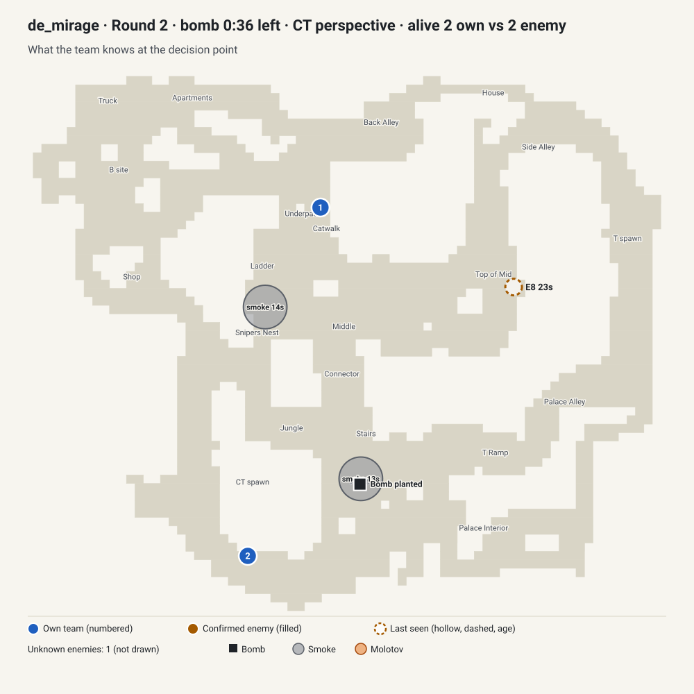
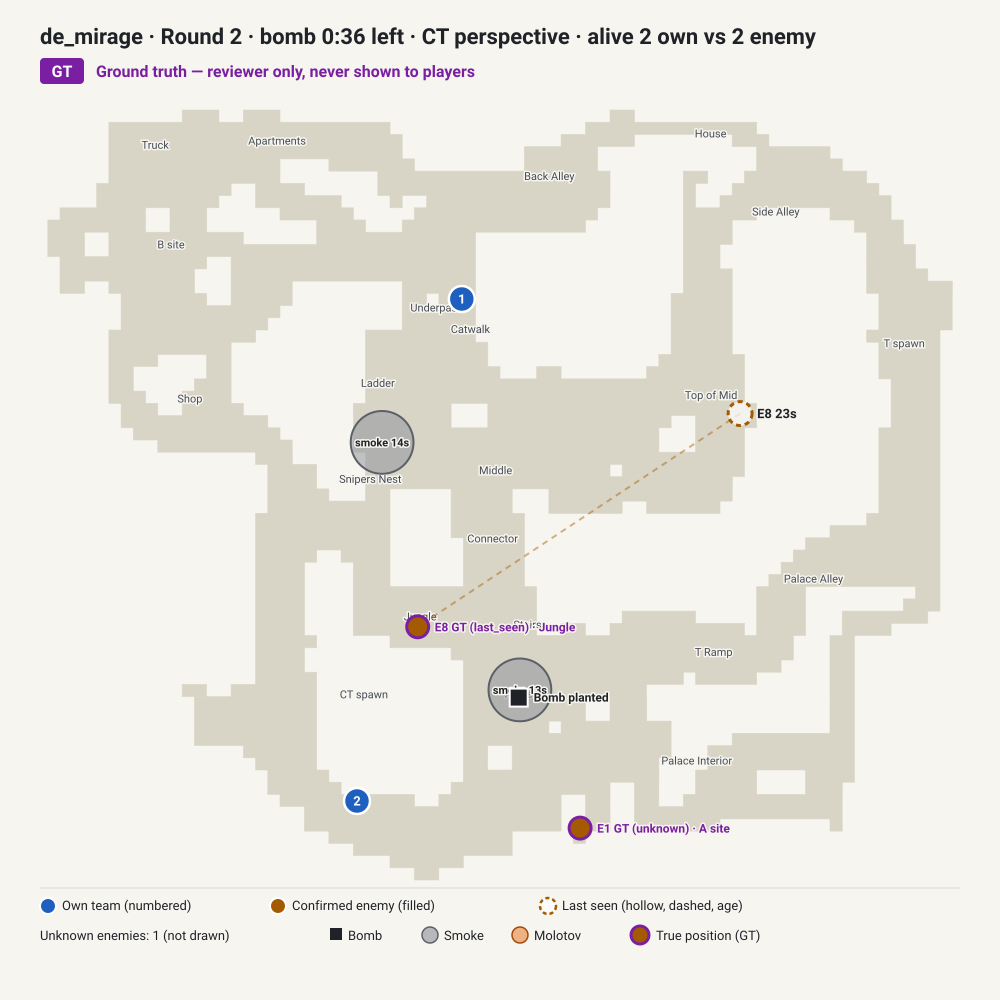

# Review packet: 2v2 retake at A on Mirage

`case_mirage_post_plant_4fb7d6` · de_mirage · CT side · status **draft** · recommendation **NEEDS TACTICAL DECISION**

Demo-grounded synthetic draft. Options, debrief and rubric are proposals generated from the source round; nothing here has had human tactical review. Time budget: 5–10 minutes.

Play it locally: `npm run content:preview -- case_mirage_post_plant_4fb7d6` then `npm run dev` and open Today.

## Why this case

Two defenders without armour or kits (a 10-second defuse) face a bomb planted at A 4 seconds earlier, 36 seconds before detonation. They are split: one in CT Spawn, one in Catwalk, about 1,500 units apart, with one HE grenade between them. One attacker with a Desert Eagle was last seen at Top of Mid 23 seconds ago; the other is unknown. The retake-or-save dilemma is genuine, but the follow-up is weak: both attackers stayed where they were and were only seen because the defenders moved in, less than a second before the first kill.

## Tactical snapshot

| Player-known view (what the brief may use) | Ground truth (reviewer only, never shown to players) |
| --- | --- |
|  |  |

## Brief as the player sees it

- **confirmed** — You play the CT side on Mirage.
- **confirmed** — The bomb is planted at A; 36 s remain on the bomb timer.
- **inferred** — The bomb was planted 4 s ago, so at least one attacker was at site A moments ago. Basis: plant announcement.
- **confirmed** — The attackers detonated a smoke in A site 13 s ago.
- **confirmed** — 2 CTs alive against 2 Ts.
- **confirmed** — Your players: SSG 08 + USP-S, 100 HP, no armour; AK-47 + USP-S, 96 HP, no armour.
- **confirmed** — No one on your team carries a defuse kit.
- **confirmed** — Your team has 1 HE grenade left.
- **confirmed** — The attackers detonated a smoke in Sniper's Nest 14 s ago.
- **confirmed** — Score: your team 0, the attackers 1.
- **confirmed** — Your team is positioned: 1 in CT Spawn, 1 in Catwalk.
- **last seen** — One attacker was last seen in Top of Mid 23 s ago with a Desert Eagle.
- **unknown** — The position of one attacker is unknown.

Evidence options (pick two): Bomb timer · Alive count · Attacker last seen in Top of Mid · Own utility · Defuse kit availability

## Recent timeline before the decision (source round)

- `-18.3 s` A T player detonated a flash in Top of Mid
- `-17.7 s` A CT player killed a T player with a USP-S in B site
- `-17.2 s` A T player killed a CT player with an AK-47 (headshot) in CT Spawn
- `-13.5 s` A T player detonated a smoke in Sniper's Nest
- `-12.9 s` A T player detonated a smoke in A site
- `-12.1 s` A T player killed a CT player with an AK-47 in A site
- `-7.0 s` A player began planting at A
- `-3.9 s` A player planted the bomb at A

## Proposed lines and scoring (proposal, not truth)

| Action | Qualifier | Main-call quality (0–100) |
| --- | --- | --- |
| Retake together through the nearest entrance | Clear the site together and trade the first contact | 100 |
| Retake together through the nearest entrance | Move as one stack and keep utility for the defuse | 90 |
| Wait for information before committing | Listen for footsteps before moving | 75 |
| Retake together through the nearest entrance | Send one player ahead to probe while the other follows | 75 |
| Wait for information before committing | Hold back and go for a late defuse | 65 |
| Save the weapons | Everyone saves and avoids contact | 25 |
| Save the weapons | Save, but take a trade if an attacker is met | 15 |

Every combination scored with the production 50/20/30 model:

```
case_mirage_post_plant_4fb7d6: 280 combinations; min 23, p25 51, median 70, p75 79, max 98; 100s: 0
  best  98  Retake together through the nearest entrance / Clear the site together and trade the first contact
  best  93  Retake together through the nearest entrance / Move as one stack and keep utility for the defuse
  best  85  Wait for information before committing / Listen for footsteps before moving
  best  85  Retake together through the nearest entrance / Send one player ahead to probe while the other follows
  best  80  Wait for information before committing / Hold back and go for a late defuse
  best  60  Save the weapons / Everyone saves and avoids contact
  best  55  Save the weapons / Save, but take a trade if an attacker is met
  follow-up 16-17 / 30  Slow down and gather more information
  follow-up    28 / 30  Change your line to use the new information
  follow-up    18 / 30  Stick to the line you chose
  follow-up     9 / 30  Stop and save the weapons
```

## Follow-up

A new sighting: About 13 seconds later, two attackers appear: one in A site, one in Jungle.

- **new** — One attacker is visible in A site right now with an AK-47.
- **new** — One attacker is visible in Jungle right now with a Desert Eagle.
- **changed** — About 23 seconds now remain on the bomb timer.

Responses and proposed follow-up quality: Change your line to use the new information = 92; Stick to the line you chose = 60; Slow down and gather more information = 55; Stop and save the weapons = 30

Follow-up caveats:

- The new information exists because the source team moved; a team on another line would not see it now.
- The next kill follows 0.2 s after the new information.

## What happened in the source round (reveal, not the answer key)

In the source round, over the next 10 s: 1 player moved from CT Spawn to A site; 1 player moved from Catwalk to Connector. Over the next 20 s the team used no utility and got 2 kills and lost no players. Bomb: a player began defusing at A. The CTs won when the bomb was defused; 2 of your team survived.

- `+13.2 s` A CT player killed a T player with a USP-S in A site
- `+13.6 s` A CT player killed a T player with an AK-47 in Jungle
- `+15.3 s` A player began defusing at A
- `+25.3 s` A player defused the bomb at A
- `+25.3 s` The bomb is defused.

What to remember (proposed): On a retake, weigh the seconds a defuse needs against what you actually know: commit while the clock and the numbers support it, and save when they do not.

## Assumptions that need judgement

- The follow-up sighting exists only because the source team moved; the attackers did not move during those 13 seconds.
- The draft's grouped-retake qualifiers assume the two defenders can move together, but they start far apart and used two routes in the source round.
- Without kits, the draft still ranks a late defuse as a waiting line; whether that is realistic is a tactical question.
- Team comms may have provided information the demo cannot show (callouts, sound cues, teammates' kill positions).
- The historical line is not assumed to be correct; it only records what this team did.
- Sightings come from the demo's spotted flag, which can register enemies a player never consciously noticed.
- Detected by a heuristic; not yet reviewed by a human CS2 reviewer.
- Post-plant: the bomb timer, not the round clock, is the deadline; whether to retake or save depends on information the demo cannot show about the enemy's utility.
- The last sighting of an enemy in Top of Mid (last seen with a Desert Eagle) is 23 s old, so that position may be stale.
- The follow-up sighting exists because the source team moved into position; a team that chose another line would not see it at this moment.
- The follow-up information arrives less than 2 s before the next kill, leaving almost no time to react.

## Questions for the reviewer

1. No kit, no armour, one HE and 36 s left at 2v2: is a retake defensible, or is saving the AK-47 and SSG 08 equally sound?
2. Can two players starting in CT Spawn and Catwalk trade each other at all, or does "retake together" first require regrouping?
3. Which route should each player take to A in practice?
4. Is a 23-second-old Desert Eagle sighting at Top of Mid meaningful evidence for this decision?
5. Should this case keep its current follow-up (both attackers seen as the defenders arrive), or should the follow-up be removed or re-authored?
6. Is one HE grenade relevant to a 10-second no-kit defuse, and what should "keep utility for the defuse" mean here?

## Your verdict

Answer the questions above in a sentence each, then record the review in the case file:

```json
"reviewers": [{ "name": "<your name>", "reviewedAt": "YYYY-MM-DD", "verdict": "approved | changes_requested", "notes": "<answers and required edits>" }]
```

Only a named human CS2 reviewer can approve. `approved` plus `status: "tactically_reviewed"` is the next step; `changes_requested` keeps it as a draft.
